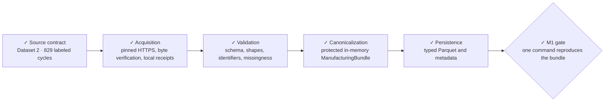

# Historical M1 execution record — 2026-09-13

This preserves the completed M1 plan and evidence before portfolio-scale
simplification. Its implementation procedures and expanded gates are historical,
not current requirements. Use the [active M1 summary](../../../docs/milestones/m01-injection-molding-ingestion.md)
and [simplification plan](../../../docs/milestones/m01-simplification.md) for current
work. Scientific source evidence remains owned by the active source contract.

# M1 — Injection-molding source contract and ingestion

**Status:** `✓ Complete — durable Dataset 2 preparation verified`

**Objective:** verify the high-resolution injection-molding source, preserve its
provenance and semantics, and reproducibly transform it into the canonical
manufacturing bundle without adding modeling.

**Revised MVP alignment:** this ingestion supports a weight-only predictive-quality
experiment under process shift. Keep completed acquisition/raw-validation evidence
and the canonicalization scope below intact. Retaining four quality characteristics
is a provenance requirement, not four modeling targets. M1 does not implement SPC,
pass/fail classification, physical RCA, experiment splits or model training.



## Tracked outputs

- `docs/datasets/injection-molding-source-contract.md`
- `configs/datasets/injection_molding.yaml`
- an acquisition manifest under `data/manifests/`
- an injection-molding adapter under `src/mpi/datasets/`
- schema, join, and fixture-backed tests
- a reproducible CLI preparation command

## Acceptance gate

- the authoritative source, release identity, file roles, license, and hashes are recorded;
- automated acquisition and redistribution boundaries are explicit;
- raw inputs remain immutable and outside Git;
- cycle identifiers join process trajectories to quality targets without ambiguity;
- validated raw inputs map to the canonical bundle and typed Parquet outputs;
- one documented CLI command reproduces the prepared bundle from admitted raw inputs;
- tests, lint, formatting, and static type checks pass.

## Completed phase — Source-contract verification

**Execution state:** complete. Dataset 2's 829 labeled cycles are accepted with
limitations at source commit
`7bd35941d75c97a3f276439377dc430ab47402be`. This completes only the source-contract
subsystem, not M1. See the
[source contract](../../../docs/datasets/injection-molding-source-contract.md) and
[source manifest](../../../data/manifests/injection-molding-source.json).

### Outcome and scope

Establish whether the selected injection-molding files can support physical
quality prediction with defensible process-to-part identity and validation
boundaries. Give the acquisition and adapter implementation a reviewable contract
based on inspected source evidence.

The canonical specification's sections 10, 27–29, and 38 govern admission,
canonical mapping, provenance, and M1 acceptance. The accepted pivot is recorded
in [ADR-0001](../../../docs/adr/0001-injection-molding-replaces-solidair.md).

At completion of this phase, implementation supplied configuration validation,
identifier types, and the CLI foundation but no dataset adapter or
`ManufacturingBundle`; `injection_molding.yaml` remained disabled while pinning
the admitted source commit.

This phase covers source inspection, permitted local evidence acquisition,
reproducible structural checks, and an admission decision. Production download
commands, adapters, Parquet preparation, modeling, and M2's full statistical audit
remain outside this phase. Detail later subsystems after this evidence is available.

### Execution sequence

1. **Establish authority and terms before downloading data.** Start from the
   publisher repository and paper linked in canonical section 5. Verify their
   relationship, identify the publisher and applicable license text, and record
   retrieval dates and immutable source references. Establish whether automated
   retrieval, local use, raw redistribution, and publication of derived artifacts
   are permitted. A paper license alone does not establish coverage of data files.
   If coverage is unclear, record the exact gap and leave acquisition blocked.
2. **Freeze an inventory.** Enumerate the source's actual files and roles.
   Investigate the candidate archives `dataset1.zip`, `dataset2.zip`, and
   `dataset3.zip`.
   Pin a commit or immutable release, then record exact paths, download URLs,
   declared sizes where available, and inclusion/exclusion reasons. Distinguish
   source-declared metadata from locally measured values.
3. **Acquire inspection evidence under the verified terms.** Store selected raw
   bytes beneath ignored `data/raw/injection_molding/`, preserving source filenames
   and version identity. Record actual byte sizes, UTC acquisition timestamps,
   and locally computed SHA-256 hashes. Inventory archive members and inspect
   formats without executing source-supplied code or modifying original bytes.
   Reuse existing bytes only after checking identity and hashes; preserve a
   mismatch as a reported discrepancy rather than overwriting it silently.
4. **Establish schema and manufacturing meaning.** For each candidate input,
   record file/member roles, dimensions, column names and types, missing-value
   encodings, physical entity per row/sample, and source-supported units. Identify
   cycle keys, experiment boundaries, production-day fields, process variables,
   pressure/flow trajectories, weight and geometry measurements, interventions,
   and operating states. Verify the specification's trajectory length and sampling
   interval against the admitted files. Distinguish elapsed signal time, cycle
   order, and real production timestamps; do not infer dates from row order.
5. **Prove identity and suitability on the selected inputs.** Count null and
   duplicate keys, matched and unmatched process/quality records, and join
   cardinalities across all selected records. Determine whether keys require an
   experiment/file namespace, and whether multiple quality characteristics or
   repeated measurements explain multiplicity. Do not use positional joins
   without authoritative alignment evidence and checks that preserve it. Record
   target availability and measurement timing, potential leakage fields, repeated
   units, and available day/experiment/chronology boundaries. Establish whether
   those boundaries can support later leakage-aware validation without designing
   the final M3 split. Record quality limits only if supplied by an authoritative
   source; absent limits remain absent.
6. **Select and hand off.** Select the primary MVP input or justified combination
   based on process-to-quality linkage and validation suitability. Explain the
   exclusions. Map only supported fields to the conceptual bundle sections and
   identify unsupported sections explicitly. Save the evidence, admission outcome,
   limitations, and concrete next action in the artifacts below. Reconcile this
   milestone's source-contract status and roadmap if execution changes readiness.

### Deliverables and their owners

| Artifact | Required content |
| --- | --- |
| `docs/datasets/injection-molding-source-contract.md` | Authority and terms; pinned source; experiment/file roles; observed schema and units; identity and join rules; targets and availability; chronology and interventions; leakage risks; quality-limit availability; bundle mapping; all three admission gates; selection, limitations, and decision. |
| `data/manifests/injection-molding-source.json` | Dataset and source identity; retrieval references; license evidence; exact acquired paths, byte sizes, SHA-256 hashes, acquisition times, and admission membership. Distinguish inspected candidates from admitted files. |
| Reproducible inspection evidence linked from the source contract | Commands or a small inspection script with invocation and environment details; exact input identities; observed shapes and key/join counts; failures and their affected files. Keep raw extracts and generated data outside Git. |

The inspection manifest describes source evidence only. Processed hashes, adapter
version, and split definition from canonical section 29 are deferred to their
producing phases; do not invent values or imply that preparation has occurred.
The contract references the manifest for exact hashes instead of maintaining a
second independent hash inventory. Any inspection script is evidence tooling,
not the production adapter.

### Decision and failure behavior

Evaluate scientific, validation, and portfolio suitability separately, then record
one admission outcome:

- **Accept:** selected inputs meet all three gates with the required evidence.
- **Accept with limitations:** all three gates still pass, but documented limits
  constrain supported claims or available fields without changing accepted MVP
  requirements. State the consequences for downstream work.
- **Reject:** observed evidence shows the selected inputs cannot satisfy a
  required gate. Explain the failed requirement and affected downstream work.

Missing evidence is **unresolved**, not acceptance or proven rejection. Network
failure, unreadable archives, uncertain license coverage, ambiguous joins, or
unsupported chronology remain explicit blockers where they prevent a gate verdict.
Continue independent inspection where possible. Failure of one candidate need not
reject a separately proven input; record the excluded candidate and assess the
selected set as a whole. A limitation that would change accepted scope requires
that decision to be resolved before dependent ingestion proceeds.

### Completion evidence

- [x] Authority, exact source identity, license coverage, and publication boundaries
  have cited evidence; terms were checked before acquiring data.
- [x] Every selected raw file has a reproducible location, measured size and hash;
  local bytes agree with the manifest and remain outside the Git upload set.
- [x] The contract accounts for every dataset-admission field in canonical section
  10, distinguishing verified facts, unavailable fields, and unresolved evidence.
- [x] Full selected-input key and join counts establish process-to-quality linkage;
  unexplained duplicates or unmatched records cannot be concealed by a sample join
  or silent row dropping.
- [x] Scientific, validation, and portfolio gates have separate evidence-backed
  verdicts, and the selected input and overall decision follow from those verdicts.
- [x] A fresh implementer can recover the same inputs, rerun the inspection, and
  understand supported bundle mapping and limitations from the saved artifacts.
- [x] Repository checks pass for any tooling changes; documentation links and
  whitespace are checked, and the milestone records results and remaining gaps.

An accepted source contract permits planning the acquisition subsystem. A rejected
or unresolved source leaves dependent ingestion blocked. Neither outcome completes
M1's end-to-end preparation gate. At this phase boundary, dataset configuration
remained disabled until implementation could consume the admitted source.

### Source-contract completion evidence

- Source authority and CC BY 4.0 coverage were checked before acquiring bytes.
- The manifest pins all three inspected archives at commit
  `7bd35941d75c97a3f276439377dc430ab47402be` with measured byte sizes and SHA-256
  hashes; local bytes are under ignored `data/raw/injection_molding/`.
- `scripts/inspect_injection_molding_source.py` verified full schemas, nulls,
  trajectory grids, unique cycle keys, and joins. Dataset 2 has 829 unique labeled
  cycles, all matched to required pressure and flow, plus 92 explicitly excluded
  signal-only cycles.
- The source contract records separate scientific, validation, and portfolio passes,
  the observed 2,048-point slightly irregular grid, unresolved geometry storage
  units, experiment-versus-day boundary limits, and candidate exclusions.
- Repository checks and the inspection rerun passed on 2026-09-12; raw inputs remained
  outside the Git upload set.

### All-candidate context refresh

The [all-candidate evidence refresh](../../../docs/datasets/injection-molding-source-contract.md#all-candidate-evidence-refresh--2026-09-12)
rechecked the three archive identities and Dataset 1/3 full joins, and reconciled
the complete online article tables. It corrects our earlier Dataset 3 table-end
claim (1,340, not 1,240); the manifest exclusion reason now reflects the remaining
overlap and unresolved ordinal basis. Dataset 1's geometry discrepancy persists
in both mean and variance. Dataset 3's target agreement improves its case for
later admission, but neither CSV provides Dataset 2's explicit experiment groups.

This is source-context and plan maintenance, not new ingestion progress. Dataset 2
remains the sole admitted source. Candidate 1/3 material, interventions, zero
duration observations and ordinal hypotheses belong to their own evidence, not
Dataset 2 unit metadata. Reconsider their admission only with a defensible
validation contract and a separately scoped mapping plan; do not concatenate
the three sources or add placeholder adapters during this phase.

## Completed phase — Reproducible acquisition

**Execution state:** complete. The accepted source contract was the prerequisite.
This phase delivers verified archive bytes and acquisition provenance, not
validated manufacturing records or a prepared dataset.

### Outcome and scope

A developer can acquire the admitted archive on a clean checkout, or reuse an
identical local archive without network access, through a documented MPI command.
The next validation subsystem receives an explicit archive identity and path;
it does not need to guess whether a download succeeded.

Acquire only the manifest's admitted `dataset2.zip`. Preserve the complete
archive, including its 92 signal-only cycles; selecting the 829 labeled cycles
belongs to validation/canonicalization. Do not download Dataset 1 or Dataset 3
as a production prerequisite. Their existing inspection evidence remains intact.

Excluded: archive extraction, HDF5 parsing, schema/join validation, bundle types,
Parquet output, modeling, source upgrades, generic downloader frameworks, and
automatic replacement of mismatched evidence. Dataset configuration remains
disabled for preparation; explicit acquisition is allowed independently of that
flag and must not advertise preparation readiness.

### Caller and handoff contract

Planned command, run from the repository root:

```powershell
uv run mpi data acquire injection_molding
```

Use the existing dataset configuration and checked-in source manifest as inputs.
Support `--raw-root <directory>` for an isolated destination (including tests and
the clean-acquisition check); default to `data/raw/injection_molding/`.
Within that root, use `scatimdata-<source_version>/dataset2.zip`, matching the
existing inspection layout. Resolve destinations beneath the selected root;
reject absolute/traversing manifest paths and unsafe link-based escapes.

Before network or output writes, validate the required manifest fields, exactly
one admitted Dataset 2 archive, positive expected size, SHA-256 syntax, and
agreement of dataset/repository/version with the configuration. The pinned HTTPS
download URL must agree with that source identity; never resolve a moving branch
or silently accept a different manifest/configuration pair.

On success, return a typed acquisition result to Python callers and report the
verified archive path, source version, size/hash, receipt path, and
`downloaded` or `reused` disposition through the CLI. Exit zero only when both
archive verification and receipt persistence succeed. The future validation
stage consumes this result, but must recheck raw identity at its own read boundary.
The result means **byte-verified**, not schema-validated or M1 complete.

### Identity, provenance, and transport decisions

- The existing `data/manifests/injection-molding-source.json` owns expected
  identities and historical inspection provenance. Acquisition reads it; it
  never updates expected hashes to match downloaded bytes or rewrites inspection
  timestamps. No second checked-in inventory is introduced.
- Write local acquisition receipts beneath the selected raw version directory,
  outside Git. Each successful invocation records dataset/candidate, source
  commit and URL, expected and observed size/hash, archive path, manifest-content
  hash, UTC verification time, disposition, and acquisition implementation/project
  version where available. Record a download timestamp only for a download made
  by that invocation; reuse must not invent the original download time. Preserve
  prior receipts and bind every receipt to its archive identity.
- Prefer direct streaming HTTPS from the manifest's immutable URL: only one
  admitted archive is needed, and this avoids requiring Git or fetching the
  excluded candidates. Existing evidence verifies Git transport, not this HTTP
  path; the implementation gate must demonstrate a real pinned HTTP retrieval.
  If that fails, report the transport gap rather than silently claiming success
  from the existing clone. A verified manual local copy remains a reuse path.
- Use existing runtime capabilities where sufficient; do not add HDF5/Pandas
  dependencies for byte acquisition. Do not import the inspection script into
  production code. Keep source-specific selection under `src/mpi/datasets/` and
  CLI dispatch in the existing CLI; factor only genuinely reusable byte checks.

### State and failure behavior

| Starting state or event | Required observable behavior |
| --- | --- |
| Final archive absent | Stream to a uniquely owned temporary file on the destination filesystem; check exact size and SHA-256 before publishing the final path. |
| Final archive present and matches | Hash the actual bytes, reuse without any network call, and create a reuse receipt; do not alter the archive. |
| Final archive present but differs | Fail nonzero with path and expected/observed identity; leave bytes untouched, do not download a replacement, and explain manual preservation/removal before retry. |
| HTTP error, timeout, truncated or oversized response, checksum mismatch | Fail nonzero; never publish unverified bytes as the final archive. Remove only temporary bytes owned by this invocation; retain diagnostic expected/observed identity. |
| Interruption or stale partial file | Partial bytes never count as an archive. Clean this invocation's partial file on handled cancellation; a later run ignores other orphaned partials rather than resuming or deleting them. |
| Another invocation targets the same destination | Serialize or fail clearly before conflicting publication. Never overwrite a final archive that appeared during acquisition; recheck it or report a conflict. Stale ownership must not be cleared automatically without proof. |
| Archive published but receipt write fails | Report nonzero and the verified archive's retained path. A rerun verifies and reuses it, then writes a receipt; do not redownload or invent a prior timestamp. |

Bound network reads with a finite timeout and an overall deadline; bound bytes
by the manifest size and reject excess data. No automatic retries are required
in this slice: rerunning the command is the explicit recovery mechanism. Do not
disable TLS verification or fall back to unpinned URLs. Publish receipts without
exposing a partial JSON file as a successful result. A blocking standard-library
HTTPS read is bounded by its finite transport timeout rather than asynchronously
cancelled mid-read; the overall deadline is rechecked after every read and before
publication, so late bytes or a late EOF cannot become a published archive.

### Implementation sequence

1. Define and test the admitted-source input validation and typed acquisition
   result against the current configuration/manifest. Keep inspection-only fields
   readable without falsely requiring deferred processed/split metadata.
2. Implement byte verification, safe destination ownership, bounded transport,
   publication, and receipt handling with injected transport for offline tests.
3. Connect the production function to the planned CLI. Exercise both downloaded
   and reused results through the real CLI-to-acquisition handoff.
4. Document acquisition and recovery in README and the source contract, preserving
   the separate three-candidate inspection instructions. Run clean live retrieval,
   then offline reuse, and record evidence here without committing raw bytes.
5. Reconcile the diagram/checklist and roadmap only after the acquisition gate
   passes. Detail raw validation next; do not implement it under this phase.

### Acceptance and evidence

- [x] A fresh destination acquires only the admitted archive via the real command;
  independently measured size and SHA-256 match the checked-in manifest.
- [x] A second invocation succeeds with networking unavailable, reports reuse,
  preserves archive bytes, and produces truthful provenance.
- [x] Offline synthetic tests cover manifest/config mismatch before effects,
  invalid paths, existing mismatches without overwrite or network access, HTTP
  failure, truncation/excess bytes, incorrect hash, interruption, destination
  conflicts, and receipt failure followed by recovery. Tests assert filesystem
  outcomes as well as exit/result status; no third-party data fixtures are added.
- [x] A success receipt parses and matches the actual produced archive and
  result. Failed or partial downloads cannot be consumed as a success result.
- [x] Existing three-archive inspection behavior remains usable; acquisition does
  not require excluded archives or claim the 829-cycle schema gate has passed.
- [x] Required repository checks pass: Ruff lint/format, Pyright, pytest, and CLI
  smoke/help. Verify raw archives, receipts, and temporary files stay outside the
  Git upload set; check documentation links and `git diff --check`.

Record the exact live command, source identity, verification results, reuse check,
and any remaining gap. Synthetic transport tests alone do not prove live retrieval;
an unavailable live endpoint leaves that gate unverified, not complete. This phase
does not require an ADR or change any accepted manufacturing semantics.

### Acquisition completion evidence

- `src/mpi/datasets/injection_molding.py` validates the checked-in configuration
  and manifest before effects, selects only the admitted Dataset 2 archive, streams
  the immutable HTTPS URL with finite bounds, and returns an `AcquisitionResult`
  after byte verification and atomic receipt persistence.
- On 2026-09-12, `uv run mpi data acquire injection_molding --raw-root
  .scratch/acquisition-live-final-20260912` started from a confirmed-absent destination
  and downloaded source commit `7bd35941d75c97a3f276439377dc430ab47402be`.
  Independent measurement found 8,708,313 bytes and SHA-256
  `69294087889a52791c296734051d6b21b30847c2859613e4178074182150c491`, exactly
  matching the source manifest.
- A second real CLI invocation with HTTP, HTTPS, and all-protocol proxies forced to
  an unavailable local endpoint reported `reused`, wrote a distinct receipt, and
  left archive size, SHA-256, and modification time unchanged. The reuse receipt
  contains no invented download timestamp.
- Synthetic tests cover input mismatch before effects, invalid manifest paths and
  URLs, resolved archive and receipt escapes, offline reuse, mismatched existing
  bytes, HTTP failure, truncation, excess bytes, checksum failure, late EOF after
  deadline, interruption cleanup, conflicting ownership, and real receipt-directory
  obstruction with offline recovery. The real CLI handoff is exercised for both
  dispositions, including nonzero retained-archive guidance and lock cleanup.
- Repository verification on 2026-09-12 passed Ruff lint and format, Pyright strict,
  28 pytest tests, CLI version/help smoke checks, inspection-tool tests, documentation
  link checks, and Git whitespace/raw-artifact hygiene. No raw archive, receipt, or
  temporary acquisition file is in the Git upload set.

## Completed phase — Raw validation

**Execution state:** complete and verified. Source admission and acquisition feed
a source-native validated Dataset 2 handoff for later canonicalization. This phase
does not close M1.

### Outcome and scope

A developer can validate the acquired archive offline and receive either a typed
successful result with explicit limitations or an actionable rejection. A matching
hash alone is not schema validation. The governing evidence is the
[source contract](../../../docs/datasets/injection-molding-source-contract.md); canonical
sections 28, 29, and 38 define the adapter boundary and eventual M1 gate.

Validate all scalar/quality records and both required pressure/flow matrices,
including signal-only columns before establishing labeled membership. Preserve
the source's full scalar schema, native numeric values, nulls, row order, column
labels, and explicit elapsed-time values. Optional cavity-pressure and state
groups are inventoried but not decoded into the MVP handoff; integral columns
already present in the scalar table remain source values, not approved features.

Excluded: Dataset 1/3 ingestion, new source admission, raw repair or replacement,
unit conversion, resampling, feature selection/engineering, ManufacturingBundle
mapping, Parquet, M2 statistical audit, M3 splits, and models. Configuration stays
disabled for preparation. No generic adapter framework is needed for this phase.

### Caller journey and produced result

Planned command from the repository root:

```powershell
uv run mpi data validate injection_molding
```

Support the same `--raw-root <directory>` layout as acquisition. This command is
local-only: resolve the pinned archive using the current manifest/configuration,
fail with acquisition guidance if absent, and never download implicitly. A
missing acquisition receipt does not invalidate matching raw bytes; report that
provenance reference as absent rather than fabricate a download event.

The Python validation entry point must also consume the actual `AcquisitionResult`
produced by acquisition. Reconcile its dataset, candidate, version, size/hash and
path against authoritative configuration/manifest identity, then rehash the actual
bytes before opening the archive. A stale or inconsistent handoff is rejected.
Share production identity checks where useful; do not import the inspection script
or duplicate its three-candidate orchestration into the production path.

Return a typed source-native validated result containing:

- archive/version/manifest identity and validator version;
- scalar fields and values in original row order, plus explicit cycle identities;
- both full required signal matrices, their source column-to-cycle mappings and
  elapsed-time axes; no silent positional alignment;
- explicit matched and signal-only memberships, preserving scalar order for the
  labeled membership and signal source order for matrix indexing;
- structured validation evidence: check identifiers, expected/observed counts,
  passed checks, and known limitations.

Data must remain usable after temporary HDF5 resources close: do not return a dead
file handle or a path to a deleted extract. Source-native arrays/tables are sufficient;
this is not a canonical bundle. The later canonicalizer must not need to reconstruct
joins from summary counts. A saved summary alone never authorizes reuse of changed
raw bytes, and mutable data must not retain an unchecked validity claim.

CLI success prints a concise validation summary and limitations; exit zero only
after every required check passes. Rejections exit nonzero and identify the failing
check, file/group/field, and expected versus observed evidence where available.
No durable validation report store is required in this slice: expose structured
evidence through the Python result and record the full-source gate outcome here.
Do not rewrite acquisition receipts or the source manifest during validation.

### Required checks and interpretation

| Boundary | Required behavior |
| --- | --- |
| Archive identity | Validate manifest/config agreement and exact archive size/SHA-256 before ZIP/HDF5 parsing. Preserve mismatches unchanged. Ensure the bytes parsed are the bytes verified, using a stable read/snapshot or equivalent mutation detection. |
| ZIP member | Require exactly one `dataset2/dynamic_data_versuch_large.h5`; reject duplicate, missing, corrupt or unsupported/encrypted members. Copy only that named member to an owned temporary file, never use unrestricted extraction. Bound expanded bytes against the inspected member size recorded during implementation; verify actual copy length/CRC. |
| HDF5 representation | Decode the released numeric pandas fixed-format blocks with explicit axes and block-item mapping. Validate unique field names, dimensions, numeric types, and complete one-to-one block coverage of columns. Reject unsupported object/pickle payloads or external-link data access rather than executing/deserializing them. |
| Scalar schema | Require the source contract's 829 rows and exact 40-column set. Preserve source order and integer identity without lossy float-to-int coercion. Check nonnull unique `cycle_counter`, nonnull integral `Versuch`, and finite nonmissing numeric values. |
| Missingness | Assert source null counts: `Charge` and `Twkz` 526 each, moisture and `PT-PT002L*` 303 each, and zero elsewhere in scalar data. Weight and the two complete geometry columns must remain complete. Null is not zero; never impute or drop rows. |
| Required signals | Each of `Einspritzdruck` and `Einspritzstrom` has 921 uniquely identified cycle columns and an explicit `time` column across 2,048 rows. Reject malformed/unrecognized cycle labels, duplicate decoded cycle IDs, nonfinite signals, or incompatible axes; do not silently skip columns. |
| Time grid | Validate increasing finite time values from 0 through 12.276 seconds, 0.006-second increments except 0.004 at destination indices 512, 1024, 1536. Compare with absolute tolerance `1e-9` seconds and no relative tolerance; preserve actual values rather than replacing them with the expected grid. Required signal axes must agree within that tolerance. |
| Joins | Compare keys, not positions: required signal cycle sets equal; exactly 829 matched, zero labeled-only and 92 signal-only; no duplicate keys. Expose actual memberships and mapping indices, not only counts. The 92 are documented exclusions from labeled membership, not defective cycles or grounds for rejection. |
| Experiments | Preserve `Versuch` blocks in source order 20, 23, 15 with 223, 303, 303 rows and source-contract cycle ranges. Do not globally sort cycle counters or invent production-day labels/timestamps. |

The schema expectations are pin-specific, not universal manufacturing limits.
Implementation must freeze full field names and exact member size from the admitted
bytes/inspection evidence and cite them in tests; abbreviated documentation names
are not literal HDF5 field names. If the pinned bytes contradict a required check,
record the discrepancy before altering the accepted source contract or gate.

Known geometry storage units, machine-native units, absent specification limits,
and experiment-to-day ambiguity remain explicit limitations in successful output.
No physical bounds, converted geometry, day labels or conformance verdicts are
inferred. Optional groups being outside validation coverage is also explicit.

### Execution and verification

1. Establish the dataset-specific typed result and raw-reader contract. Use the
   existing inspection code as evidence for HDF5 layout, not production dependency.
   Add a locked runtime HDF5 reader dependency (the inspected `h5py` route is the
   starting point) and declare NumPy directly if production code imports it. Do
   not add Pandas/PyTables solely to deserialize this known numeric layout.
2. Implement safe identity-to-member reading and pure structural/semantic checks.
   Keep temporary-resource ownership explicit and clean only invocation-owned
   files on success, rejection, or handled interruption. Errors must not return
   partial data with a successful validation status.
3. Connect the local-only CLI and acquisition-result entry point to the same
   validator. Synthetic fixtures should exercise genuine small ZIP/HDF5 layouts
   generated in tests; no downloaded binary fixtures belong in Git. Internal
   small-fixture expectations must not become a public bypass of the pinned gate.
4. Verify all required rules with distinguishing negative cases: wrong hash before
   parser access; missing/duplicate member; malformed blocks/axes; duplicate or
   fractional identities; missing target versus allowed null context; unexpected
   signal columns; mismatched sets despite equal counts; irregular-grid mismatch;
   and experiment-order changes. Independently shuffle signal columns in a fixture
   and prove mappings still associate the correct cycle values.
5. Pass an actual acquisition result into validation, including a changed-archive
   rejection after acquisition. Prove output data remain accessible after cleanup,
   and that failures leave raw bytes and prior receipts unchanged. Exercise CLI
   success and rejection without network access, not just a mocked validator.
6. Run the full admitted archive through the production validator, compare counts,
   memberships, missingness, experiment blocks and time grid to the independent
   source evidence, and record command/version/results here. No fresh download is
   required when existing bytes match. Run repository CI checks and CLI help;
   reconcile README, source-contract next action, roadmap and this diagram only
   after the validation gate passes.

### Acceptance gate for this phase

- [x] The local-only command validates the full pinned Dataset 2 archive and reports
  829 matched / 0 labeled-only / 92 signal-only, with all required checks passing.
- [x] Actual acquisition output reaches validation, stale identity is rejected,
  and the successful typed handoff preserves source values, nulls, order, axes,
  join mappings, provenance and limitations after resources close.
- [x] Synthetic malformed-data tests distinguish structural failure from accepted
  limitations; failures cannot publish a successful or partially validated result.
- [x] Raw archives/receipts remain untouched; owned extracts are cleaned and no
  generated dataset enters Git. Full-source proof complements offline CI fixtures.
- [x] Ruff lint/format, Pyright, pytest, CLI smoke/help, documentation links and
  whitespace checks pass. Evidence and tracker status agree.

### Raw-validation completion evidence

- Production code: `src/mpi/datasets/injection_molding_validation.py` provides the
  typed source-native result, strict fixed-format HDF5 reader, archive/member safety,
  exact schema/semantic checks, and acquisition-result handoff. `mpi data validate
  injection_molding` is local-only and supports `--raw-root`.
- Full-source run on 2026-09-12 used Python 3.12, h5py 3.16.0, and NumPy 2.5.3
  against archive SHA-256
  `69294087889a52791c296734051d6b21b30847c2859613e4178074182150c491`.
  All 10 production checks passed: 829 scalar rows and 40 exact fields; required
  pressure and flow shapes of 2,048 × 921; exact missingness; pinned time grid;
  experiment blocks 20/23/15 with 223/303/303 rows; and 829 matched / 0
  labeled-only / 92 signal-only memberships.
- A reused `AcquisitionResult` from the ignored `.scratch` live-acquisition root
  passed through the production validator with its identity-bound receipt reference
  intact. Local validation does not guess among receipts, and unrelated supplied
  receipts are not advertised as provenance. The 21 raw-validation tests cover
  post-acquisition byte changes, mutation during validation, stale handoffs,
  malformed and duplicate ZIP members, malformed HDF object kinds, external links
  and external numeric storage, fractional identities, mismatched equal-count signal
  sets, grid and experiment-order drift, shuffled signal columns, allowed context
  nulls versus missing targets, actual temporary-extract cleanup after success,
  rejection and interruption, immutable output arrays, and preservation of raw
  evidence on rejection.
- Repository verification: `uv run ruff check .`, `uv run ruff format --check .`,
  `uv run pyright`, `uv run pytest`, `uv run mpi --version`, `uv run mpi --help`,
  `uv run mpi data validate --help`, and `git diff --check` passed. The full-source
  CLI run also passed offline and reported the required membership and limitations.

## Completed phase — Canonicalization

**Execution state:** complete. This bounded M1 slice mapped the production-validated
Dataset 2 source to a protected, typed in-memory bundle. It did not itself close
M1; persistence and the final one-command gate followed in the phase below.

### Outcome and scope

Turn the actual `ValidatedInjectionMoldingSource` into a typed, in-memory
`ManufacturingBundle` that later persistence and analytics can consume without
reopening HDF5 or reconstructing source-specific joins. Canonical specification
sections 13–14, 27–29 and 38 govern the representation and boundary; the
[source contract](../../../docs/datasets/injection-molding-source-contract.md#canonical-bundle-handoff)
governs Dataset 2 meaning and limitations.

Include all 829 admitted units, both required trajectories, all released quality
characteristics, and source scalar/context values. Keep the 92 signal-only cycles
out of canonical tables, with their identities and exclusion reason attached to
the bundle. Their raw evidence and validated source matrices remain unchanged.
Record `weight` as the required MVP target in grams and geometry as
experimental/deferred in dataset policy metadata, distinct from the publisher's
measurement facts. Preserve all existing quality rows/nulls; do not drop geometry
to enforce a modeling policy or rename the source characteristic to `part_weight`.

Excluded: new acquisition or source admission, Dataset 1/3, Parquet publication or
loading, the final preparation CLI, dataset enablement, optional cavity/state
decoding, engineered features, statistical audit, splitting and modeling. Retaining
source integral columns does not approve them as model features. No geometry
conversion, imputation, normalization, resampling, inferred days or conformance
classification is permitted. Keep `enabled: false` until the later preparation gate.

### Caller journey and implementation boundary

1. A caller runs existing local validation (or validates an actual acquisition
   result), then passes that returned object to a dataset-specific canonicalizer.
2. The canonicalizer checks supported dataset/source/validator identity and the
   structural invariants it consumes. It joins trajectories by explicit cycle
   mappings, projects the admitted membership, and constructs canonical tables.
3. It checks table schemas, keys, references and semantic invariants, then returns
   one complete bundle with bound metadata, exclusions and mapping evidence.
   A failure returns an actionable exception, never a partially successful bundle.
4. The caller can inspect tables and metadata after all source resources close.
   There is no download, disk output, archive reparse or implicit preparation in
   this transformation. A current validation result is an in-memory snapshot, not
   a promise that a path on disk will remain unchanged indefinitely.

Use Polars as the specification's primary dataframe engine, adding a directly
declared, locked dependency when implementation starts. Introduce only the typed
bundle and explicit table contracts needed here; reuse existing identifier types.
Dataset-specific mappings belong under `src/mpi/datasets/`; shared bundle shape
and dataset-independent key/reference checks may live under `core`/`data` in the
canonical layout. Do not build a generic adapter registry or implement the entire
conceptual adapter interface. PyArrow/storage policy can wait for persistence.

The ordinary entry point takes the validated object, not arbitrary paths or a
JSON summary. Its public dataclass type alone is not proof of validation: reject
inconsistent memberships, shapes or mappings and unsupported identity/version.
Do not repeat HDF5 parsing or claim to cryptographically authenticate caller-made
objects. Keep any small-fixture path internal; production must retain the pinned
829/0/92 contract. Existing acquisition and validation commands remain unchanged.

### Canonical tables and meaning

The specification's model is conceptual and explicitly permits unsupported fields.
Use these concrete Dataset 2 mappings; do not reinterpret conceptual `timestamp`
as a wall-clock date. Canonical fields use the English names defined below;
raw validation continues to use literal source identifiers.

| Section | Grain, fields and rules |
| --- | --- |
| `units` | One row per admitted cycle, in scalar source order. `unit_id = injection_molding/dataset2/<cycle_counter>`; retain integer `cycle_counter` and zero-based `source_row_index`. `product_family = stacking box`; `material = BASF Ultramid B3EG6 (PA6-GF30)` is a paper-declared dataset constant, not a raw per-row observation. Record its dataset-level lineage. Unsupported `batch_id` and `production_time` are typed nulls, not guessed from `Charge`. |
| `operations` | One row per unit, same order. `operation_id = <unit_id>/injection_molding`, `process_stage = injection_molding`; `machine_id`, `start_time`, `end_time` are typed nulls. The known machine model belongs in metadata, not an invented machine identifier. |
| `process_features` | One row per unit/operation in source order. Map the 31 source process columns to their English names below, preserving numeric types and values; this is a process-data table, not an approved training matrix. Identify the 15 `integral_` columns in metadata as retained optional source summaries with feature eligibility deferred. |
| `signals` | Wide channels: one row per admitted unit and sample, with `unit_id`, `operation_id`, zero-based integer `sample_index`, Float64 `elapsed_time_seconds`, Float64 `injection_pressure`, Float64 `injection_flow`. Order by scalar source unit order, then original sample index. Preserve all 2,048 samples without interpolation. Use pressure's actual time values as the shared axis after enforcing the validator's pressure/flow agreement tolerance; metadata records this choice and tolerance. |
| `quality` | Long form: one row per unit and characteristic, in source unit order then `weight`, `GE-GE002*`, `GERADEHEIT-L*`, `PT-PT002L*` order. `characteristic` preserves these names; `measured_value` is nullable Float64, `measurement_unit` is `g` for weight and null for geometry. `lower_spec` and `upper_spec` are nullable Float64 and always null. Keep missing measurements as rows with null values. |
| `context` | One row per unit, source order, with `experiment_id`, `mean_moisture_content`, `mold_temperature`, `source_charge_code` mapped below; preserve source types and nulls. `production_day` is typed null. `experiment_id` is an experiment boundary, not a day; none of these fields is automatically an available predictor. Do not synthesize recipe, operating state or batch genealogy. |
| `metadata` | Bind source/manifest/archive identity, validator and adapter/schema versions, optional verified receipt reference, citations/license, source-to-canonical mapping, source dtypes and units, transformations, table counts, exclusions, validation/mapping evidence and limitations to this result. Preserve unknown units explicitly. Processed hashes, split definition and a download timestamp not supplied by verified provenance remain absent; the future persistence manifest owns them when applicable. |

Nullable wall-clock fields use an explicit datetime dtype, but no timezone or
instant is inferred. Nullable text fields use String. Canonical IDs are nonnull
String; indices are nonnegative integers. Source integer context/process fields
remain integers and floating-point values retain Float64 precision. Source NaN
missing values become typed nulls, never zeros. Long-form quality may widen exact
source int32 geometry to Float64 without value loss; record that representation
change and original dtype. Do not truncate measurements or stringify numbers.

The exhaustive scalar partition is 1 cycle identity + 1 experiment field + 3
context fields + 31 process fields + 4 quality fields = 40. Every source scalar
column has exactly one value owner; metadata links original names to those owners.
Quality fields must never appear among process features or context predictors.
Do not rename an unresolved geometry field to the paper's “Distance B.”

### English naming and source lineage

**Accepted plan revision:** canonical tables use stable English `snake_case`
field names. Raw archives, the source-native validator/result, source schema
expectations and historical inspection evidence retain their original names.
This is a representation change only: no change to admission, values, nulls,
units, physical meaning, feature eligibility or the 40-column partition.

The following is the exhaustive scalar mapping. For `quality`, the destination
is a `characteristic` value rather than a wide column. Opaque geometry identifiers
are deliberate exceptions to English naming: retain their exact spelling,
punctuation and case, including `GERADEHEIT-L*`, as source measurement codes.
Do not turn a literal translation into a newly claimed physical target definition.

| Source scalar field | Canonical section | Canonical field / characteristic |
| --- | --- | --- |
| `Versuch` | context | `experiment_id` |
| `mittlerer Feuchtegehalt` | context | `mean_moisture_content` |
| `Twkz` | context | `mold_temperature` |
| `Charge` | context | `source_charge_code` |
| `cycle_counter` | units | `cycle_counter` |
| `cycle_time` | process_features | `cycle_duration` |
| `Max. Spritzdruck` | process_features | `maximum_injection_pressure` |
| `Umschaltspritzdruck` | process_features | `switchover_injection_pressure` |
| `staudruck_ist` | process_features | `actual_back_pressure` |
| `einspritzzeit` | process_features | `injection_time` |
| `Massepolster` | process_features | `melt_cushion` |
| `dosierzeit` | process_features | `dosing_time` |
| `zylinderheizzone_1` | process_features | `barrel_heating_zone_1` |
| `zylinderheizzone_2` | process_features | `barrel_heating_zone_2` |
| `zylinderheizzone_3` | process_features | `barrel_heating_zone_3` |
| `zylinderheizzone_4` | process_features | `barrel_heating_zone_4` |
| `zylinderheizzone_5` | process_features | `barrel_heating_zone_5` |
| `zylinderheizzone_6` | process_features | `barrel_heating_zone_6` |
| `zylinderheizzone_7` | process_features | `barrel_heating_zone_7` |
| `zylinderheizzone_8` | process_features | `barrel_heating_zone_8` |
| `werkzeugheizkreis_1` | process_features | `mold_heating_circuit_1` |
| `integral_idx_0_werkzeuginnendruck_ist_state_1` | process_features | `integral_idx_0_actual_cavity_pressure_state_1` |
| `integral_idx_0_werkzeuginnendruck_ist_state_2` | process_features | `integral_idx_0_actual_cavity_pressure_state_2` |
| `integral_idx_0_werkzeuginnendruck_ist_state_8` | process_features | `integral_idx_0_actual_cavity_pressure_state_8` |
| `integral_idx_0_messgrafik_state_1` | process_features | `integral_idx_0_measurement_trace_state_1` |
| `integral_idx_0_messgrafik_state_2` | process_features | `integral_idx_0_measurement_trace_state_2` |
| `integral_idx_0_messgrafik_state_8` | process_features | `integral_idx_0_measurement_trace_state_8` |
| `integral_idx_1_messgrafik_state_1` | process_features | `integral_idx_1_measurement_trace_state_1` |
| `integral_idx_1_messgrafik_state_2` | process_features | `integral_idx_1_measurement_trace_state_2` |
| `integral_idx_1_messgrafik_state_8` | process_features | `integral_idx_1_measurement_trace_state_8` |
| `integral_idx_0_einspritzdruck_ist_state_1` | process_features | `integral_idx_0_actual_injection_pressure_state_1` |
| `integral_idx_0_einspritzdruck_ist_state_2` | process_features | `integral_idx_0_actual_injection_pressure_state_2` |
| `integral_idx_0_einspritzdruck_ist_state_8` | process_features | `integral_idx_0_actual_injection_pressure_state_8` |
| `integral_idx_0_einspritzstrom_ist_state_1` | process_features | `integral_idx_0_actual_injection_flow_state_1` |
| `integral_idx_0_einspritzstrom_ist_state_2` | process_features | `integral_idx_0_actual_injection_flow_state_2` |
| `integral_idx_0_einspritzstrom_ist_state_8` | process_features | `integral_idx_0_actual_injection_flow_state_8` |
| `weight` | quality | `weight` |
| `GE-GE002*` | quality | `GE-GE002*` |
| `GERADEHEIT-L*` | quality | `GERADEHEIT-L*` |
| `PT-PT002L*` | quality | `PT-PT002L*` |

Signal mappings remain `Einspritzdruck` → `injection_pressure` and
`Einspritzstrom` → `injection_flow`, with source `time` →
`elapsed_time_seconds`. Store the source groups and per-cycle source column
identities, or their exact reversible prefix/cycle rule, in lineage metadata.

English aliases are project labels, not new publisher declarations. In particular,
`source_charge_code` preserves the nullable source value without claiming a valid
material-batch key; `mold_temperature` does not assert setpoint versus actual.
`measurement_trace`, `idx_0`/`idx_1` and state numbers preserve opaque source
distinctions: do not assign those traces to pressure/flow or name physical phases.
`actual` translates the source token `ist`, not verified sensor calibration or
prediction-time availability. Do not add unit suffixes such as `_s`, `_bar`,
`_celsius` or `_mm` to unresolved source measurements. Only the established
elapsed-time axis has a seconds suffix; weight's established grams stay in unit
metadata. The name `cycle_duration` does not establish its numerical unit.

Implement one explicit dataset-owned mapping, not runtime translation, automatic
slugification or a second set of German alias columns. Generate bundle lineage
from that same mapping: source group/name, canonical section/name (or quality
characteristic), source/canonical dtype, unit and unresolved-unit state, plus
representation changes. The map must exactly cover the validator's 40 scalar
fields once, with no duplicate destinations within a section or collisions with
structural columns such as `unit_id` and `operation_id`. Reject missing, extra or
colliding entries; never silently leave an unmapped German field in canonical
output. Original names in metadata and the explicit geometry exceptions are
intentional, not mapping failures.

Treat these names as the first canonical schema, with a mapping version bound to
adapter/schema versions. Later renames must update that version and affected
contracts/consumers; this phase has no existing canonical consumers or persisted
bundles to migrate. Acquisition/raw-validation behavior and evidence are unchanged.

### Source-context handoff requirements

The [source contract](../../../docs/datasets/injection-molding-source-contract.md#paper-supported-material-and-measurement-context)
owns the follow-up evidence and citations. Preserve these distinctions in bundle
metadata rather than leaving them only in prose outside the consuming handoff:

- Paper-declared material/manufacturer/grade and measurement equipment specifications,
  with their source sections and dataset-level scope. Keep optical maximum deviation
  and balance linearity deviation as different quantities with their own units;
  neither populates `lower_spec`/`upper_spec` or a per-record uncertainty column.
- Observed context run lengths/values and the inferred experiment-to-paper-day
  hypotheses (20 → 2, 23 → 3, 15 → 1), explicitly marked inferred with evidence
  references. Canonical `production_day` stays null. Do not turn paper ordinal
  start-up/running intervals into canonical labels without a confirmed crosswalk.
- The unresolved experiment-15 moisture discrepancy: preserve raw 0.050/0.100/0.150
  alongside separately identified paper values 0.066%/0.097%/0.150% in discrepancy
  metadata, never as replacement measurements. Distinguish paper-declared context
  units from unverified storage-unit mappings. No null backfill is permitted.
- The paper's enumerated 12-scalar conceptual feature set and exclusion of moisture interventions
  from its predictors. Keep `mean_moisture_content` context-only for this handoff;
  retain all 31 process columns without presenting them as that published feature
  set or an approved training matrix. Preserve the distinction between direct
  name correspondences and the proposed `werkzeugheizkreis_1` → hot-runner
  temperature crosswalk; do not promote that proposal to a confirmed semantic
  mapping. Exact paper replication is not this gate.
- Geometry-scale evidence may include the matching mean/variance comparison,
  explicitly marked inferred. Geometry units remain null and values stay native.
  Signal-only range summaries describe observed counter positions, not causes or
  authoritative experiment assignments. Actual exclusion IDs and the existing
  `no_released_scalar_quality_row` reason remain the consuming contract.
- The remaining source gaps and provenance links. A successful raw-schema check
  does not resolve physical meaning, export discrepancies or inference availability.
- The accepted weight-only MVP use, deferred geometry role, and process-only
  modeling boundary as project policy, not source-declared facts. Distinguish the
  pinned published release from a complete original laboratory database. Retained
  process/context fields do not automatically enter the future feature allowlist.

Tests must distinguish a paper-declared dataset constant from a raw per-row value,
an inferred day from an authoritative label, and a reported equipment specification
from a quality limit. Verify discrepancy metadata remains bound to the relevant
source/experiment and original values; no change to raw admission or parsing is
required. Use structured fields for these distinctions, not an undifferentiated
string that a later consumer must interpret as settled fact.
Include a source-contract evidence reference and dataset scope for each claim;
the all-candidate research does not require copying Dataset 1/3 observations into
the Dataset 2 bundle. Tests must keep proposed feature mappings and geometry
conversions distinct from confirmed facts, and must not manufacture labels for
signal-only cycles from a numerical range.

### Invariants, rejection and reproducibility

- Unit IDs and operation IDs are unique; every foreign key resolves to the same
  admitted unit, and each operation belongs to exactly one unit. No signal-only
  unit occurs in any canonical table. Exclusion metadata contains all 92 actual
  IDs with reason `no_released_scalar_quality_row`, not a defective-part label.
- Production counts are 829 rows each for units, operations, process features
  and context; 1,697,792 signal rows (829 × 2,048, two channel columns); and
  3,316 quality rows (829 × 4), of which exactly 303 measurements are null, all
  for `PT-PT002L*`. Context retains null counts 526/526/303 for
  `source_charge_code`/`mold_temperature`/`mean_moisture_content`.
- Pressure and flow are looked up independently by cycle ID. Equal dimensions
  or row counts cannot substitute for key agreement. Missing or duplicated keys,
  mismatched references, incomplete scalar partition or unsupported field types
  reject the whole transformation with the failed rule and relevant identity.
- Preserve experiment blocks 20/23/15 and counts 223/303/303; preserve each source
  sample and irregular time grid. No global cycle-counter sort is allowed.
- Repeated mapping of the same validated result gives the same schemas, ordered
  values and semantic metadata. Do not inject random IDs or “now” timestamps.
  Do not mutate source arrays/maps or expose a reusable passed-check claim that
  callers can invalidate unnoticed. Bundle consumers must receive protected data
  or revalidate after mutation; a frozen wrapper around mutable tables is not
  sufficient proof by itself. Persistence must enforce its own boundary later.
- Unknown units, absent time/limits, deferred feature availability and omitted
  optional signals are successful limitations, not fabricated values or rejection.

### Execution and acceptance evidence

1. Define the minimal bundle/table contracts and dataset-specific field partition.
   Implement the explicit English mapping above and derive lineage from it. Lock
   Polars, keep code strictly typed, and document null and time mappings. Do not
   create placeholder subsystems for later datasets.
2. Implement the pure mapping and whole-bundle contract check. Preserve provenance
   and validation limitations, add explicit transformation/membership evidence,
   and keep deterministic ordering independent of signal column order.
3. Use generated small ZIP/HDF5 fixtures through the real validator-to-canonicalizer
   handoff, not only manually constructed happy-path objects. Independently shuffle
   pressure and flow cycle columns and use distinguishable per-cycle/sample values
   to prove correct joins. Include signal-only cycles, nullable context, missing
   geometry, exact integer geometry, and irregular time values.
4. Add negative boundary cases for inconsistent handoffs, unsupported identity,
   duplicate/missing membership and references, and target leakage into process
   columns. Test missing/extra mapping entries, duplicate destinations and reserved
   name collisions. Independently assert all 40 expected English/code destinations
   and original-name lineage; do not derive test expectations from the production
   mapping itself. Assert whole-result rejection, source nonmutation, determinism, values
   after resource cleanup, and the chosen protection/revalidation behavior.
5. Run actual production validation followed by canonicalization on the full
   admitted archive. Independently compare each canonical source-derived column
   and both complete trajectory channels by key against the validated input, not
   just row counts. Verify the table counts above, exact null masks, all exclusion
   identities, experiment order, sampling values, lineage and absent metadata.
   Existing matching local bytes suffice; no fresh download or saved bundle is
   required. Record the reproducible Python invocation, source identity and results.
6. Run the repository CI checks (locked sync, Ruff lint/format, Pyright, pytest,
   CLI version) plus CLI help, documentation-link and whitespace checks. Reconcile
   this phase's evidence, diagram and roadmap only after its gate passes.

- [x] The real validated-source handoff produces a complete typed bundle without
  I/O, invented semantics, value loss or unauthorized features.
- [x] Distinguishing fixture tests establish key-based joins, target separation,
  null/time/identity preservation, deterministic output and whole-result rejection.
- [x] Every source field has exactly one documented canonical destination, English
  aliases match the explicit map, opaque geometry codes remain unchanged, and
  lineage can recover the original source names without duplicate alias columns.
- [x] Bundle metadata preserves confirmed material/equipment context, inferred day
  hypotheses, the moisture discrepancy and published feature-set constraints as
  distinct evidence states; canonical days/limits remain null and raw values intact.
- [x] Weight-only MVP policy and deferred geometry are explicit without deleting
  quality evidence, granting feature eligibility or inventing conformance labels.
- [x] Full admitted-source evidence establishes exact mappings and counts; fixture
  success alone does not prove this gate. Unavailable local bytes leave this proof
  outstanding, not waived.
- [x] Repository checks pass; raw data, generated tables and receipts stay outside
  Git, and acquisition/validation behavior remains intact.

### Canonicalization completion evidence

Implementation is owned by
`src/mpi/datasets/injection_molding_canonicalization.py` and the shared protected
table/metadata contract in `src/mpi/data/canonical.py`. Polars is a direct locked
runtime dependency. The bundle owns its source-derived values and returns cloned
tables on access; metadata, evidence states, lineage and exclusions are immutable.
No raw archive, canonical table, receipt or other generated dataset is tracked.

The full-source proof is reproducible from existing identity-matching raw bytes:

```powershell
$env:UV_CACHE_DIR = Join-Path (Get-Location) '.uv-cache'
uv run python scripts/verify_injection_molding_canonicalization.py data/raw/injection_molding
```

The verified source was commit
`7bd35941d75c97a3f276439377dc430ab47402be`, archive SHA-256
`69294087889a52791c296734051d6b21b30847c2859613e4178074182150c491`
(8,708,313 bytes), and manifest SHA-256
`2fa05d39dfb5f2915df163a874305b95b9350661c5f8999e2a8cf10323e0c6f3`.
The verifier reported `status: passed`, compared all 40 source scalar fields
(33,160 scalar cells), and independently compared all 1,697,792 pressure values,
all 1,697,792 flow values and all 1,697,792 elapsed-time values by cycle key.
It confirmed 829 rows each for units, operations, process features and context;
1,697,792 signal rows; 3,316 quality rows; 303 quality nulls; and all 92 explicit
`no_released_scalar_quality_row` exclusions.

Generated ZIP/HDF5 fixture tests exercise the actual validator-to-canonicalizer
handoff with independently shuffled channel columns, distinguishable channel
values, the native irregular increment, signal-only membership, nullable context,
missing and exact-integer geometry, all 40 independently asserted destinations,
source nonmutation, owned-copy protection and deterministic output. Negative cases
reject unsupported identity, inconsistent/duplicate/missing membership and
references, altered channel mappings, equal-but-corrupted time axes, field-relocated
nulls, nonfinite process values, interleaved experiment rows, missing/extra scalar
mappings, duplicate destinations, reserved collisions, target-owner changes and
unversioned renames. Metadata assertions distinguish paper facts from proposed
crosswalks and check experiment-bound raw/paper run values and their units directly.

Verification on 2026-09-13 passed locked dependency sync, Ruff lint and format
checks, strict Pyright, the full Pytest suite, CLI version/help smoke tests,
relative documentation-link validation and Git whitespace checks. The commands
were `uv sync --locked --group dev`, `uv run ruff check .`,
`uv run ruff format --check .`, `uv run pyright`, `uv run pytest`,
`uv run mpi --version`, `uv run mpi --help`, `uv run mpi data validate --help`,
the repository-local relative-link assertion, and `git diff --check`. Results were
36 locked packages audited, 48 files formatted, zero Ruff or Pyright findings,
68 tests passed, CLI version `0.0.1`, all help invocations successful, 14 Markdown
files checked with no missing relative targets, and no whitespace errors.

Unresolved geometry/machine units, experiment-to-day mapping and prediction cutoff
remain owned by source evidence and later phases; this mapping preserves their
unknown/deferred state and does not depend on resolving them. The persistence plan
below covers typed Parquet round trips, publication/recovery, processed
provenance, and the final one-command M1 gate. No new ADR or domain owner is needed
for this bounded realization of the accepted source contract.

Later-phase handoff: M2 must report experimental interventions and raw/paper
discrepancies without silently repairing data. M3 must resolve predictor
availability and an explicit allowlist, keeping project choices separate from
the paper's feature set. Its primary benchmark is leave-one-experiment-out on
15/20/23, with separate ID results and leakage-safe tuning/calibration membership.
Never assign canonical days from the current hypotheses. M4–M6 compare weight
models on scalar, engineered and compressed representations; M5 owns any
feature-level sampling/early-cycle representation decision. M7/M8 evaluate
uncertainty under shift and AUTO-PREDICT / MEASURE risk-coverage, not conformance.
SPC and physical diagnosis are not MVP tasks. These are
constraints for later planning, not authorization to implement those milestones.

If Dataset 1/3 is proposed later, its M2 audit must expose literal zero cycle
durations and counter gaps without silent repair. Its M3 plan must distinguish
paper ordinals from released row/counter identities and justify grouping before
claiming cross-day generalization. Dataset 1 additionally needs an explicit
geometry-target decision; Dataset 3's corrected table end is not a resolved day
crosswalk. Do not make resolution of these non-admitted candidates a blocker for
the authorized Dataset 2 canonicalization gate.

## Persistence and preparation completion evidence

**Execution state:** complete and verified. This bounded slice closes M1; it did
not begin M2. Its prerequisite was canonicalization at `59e0b92`.

### Outcome and scope

A local caller can prepare admitted Dataset 2 raw bytes once, then reload a
verified, protected `ManufacturingBundle` without the raw archive or source tree.
The durable result preserves the six canonical tables and all semantic metadata,
not merely a training matrix. This implements canonical specification sections
27–30 and 38; the completed canonicalization contract remains the schema owner.

Include typed Parquet writing/reading, versioned JSON metadata and processed
provenance, safe publication/reuse, a dataset-specific preparation API, CLI
integration, configuration readiness, and the full-source M1 proof. Do not add
downloads to preparation, source repair, optional-signal decoding, features,
splits, training, audit reports, generic adapter registries, or artifact services.

Use the existing Polars runtime for the table round trip; no second dataframe
representation is required. Keep dataset semantics in the injection-molding
adapter. Shared serialization helpers may live beside `ManufacturingBundle`, but
must not become a general persistence framework. No historical processed format
requires migration: introduce format version 1 and reject unsupported versions.

### Caller journey and public boundary

The planned ordinary command is:

```powershell
uv run mpi data prepare injection_molding --raw-root data/raw/injection_molding --output data/processed/injection_molding/dataset2
```

Preserve the existing `mpi data` command family and underscore dataset identifier.
The paths shown are defaults; `--output` names one complete bundle directory, not
a parent into which an implicit latest version is selected. Preparation runs
offline: validate current raw bytes, canonicalize, persist, reload and verify,
then report the output path, publication/reuse disposition, source identity,
manifest hash, counts and limitations. Missing raw bytes fail with the existing
acquisition guidance; preparation must not silently download them.

Provide a dataset-specific `prepare` function and `load_bundle(path)` entry point
usable by later M2 code. The loader reads only the named artifact and returns the
same protected bundle type; it needs neither network, raw data, Git nor repository
configuration. CLI failures exit nonzero with the failed rule and affected path;
no partial bundle or success summary may escape a failed operation.

### Durable artifact contract

One complete artifact contains `units.parquet`, `operations.parquet`,
`process_features.parquet`, `signals.parquet`, `quality.parquet`,
`context.parquet`, `metadata.json`, and `manifest.json`.

- Preserve exact ordered columns, row order, canonical dtypes (including nullable
  timestamps and integers), values and null masks. Do not sort, resample, pad,
  widen geometry again, infer units, or lose all-null columns during reload.
- Serialize every `BundleMetadata` field explicitly, including nested immutable
  lineage, exclusions, quantities, runs, associations and evidence states. Reload
  reconstructs their types, rather than returning loose dictionaries or strings.
  Unknown units remain null; hypotheses and project policy remain distinct from
  documented facts. A receipt path remains provenance, not a loader dependency.
- The versioned manifest inventories the seven payload files with exact relative
  names, sizes and SHA-256 hashes, table schemas/counts, dataset/source identity,
  raw and source-manifest hashes, validator/adapter/schema/mapping/package versions,
  preparation configuration and its identity, license and source URL. Do not hash
  the manifest into itself; return or record its separately computed hash.
- Include preparation code identity: Git commit and dirty state when available;
  explicitly mark unavailable Git evidence and retain package/version information.
  A dirty tree must never be represented as an exact clean-commit build. Preserve
  acquisition timestamp only from an identity-validated receipt when present;
  otherwise store null plus an availability reason, never substitute preparation
  time or an unrelated inspection/download date.
- Record weight in grams as the required target, geometry as retained/deferred,
  and split definition as `not_created` (M3 owns it). Process-column count means
  retained fields, not an approved predictor count. Record preparation time as
  execution provenance, separate from production chronology and semantic identity.
- Generated artifact manifests stay with ignored outputs; the tracked acquisition
  manifest remains immutable source evidence. Commit only safe completion hashes
  and invocation evidence to the milestone, not generated tables or local receipts.

### Validation, publication and reruns

Persistence is a new trust boundary: the public bundle constructor can receive
caller-created tables, and disk files can change. Reuse/refactor the canonical
schema and invariant checks into a callable owner rather than duplicating a
weaker persistence schema. Validate before writing and after reading. Enforce
the complete production contract: keys, memberships, table order, counts,
field-specific missingness, native grid, contiguous experiments, target separation,
null days/specs, lineage and evidence consistency. Test fixtures may use internal
expectations; public preparation/loading must retain the fixed Dataset 2 contract.

Readers reject missing/extra payloads, malformed metadata, incompatible versions,
hash/size/schema mismatches and inconsistent cross-table or metadata identities.
Manifest paths must be the allowlisted relative filenames; reject traversal,
absolute paths and symlink/reparse-point escapes. Hashes establish internal
integrity, not publisher authenticity: a coherently forged artifact cannot be
authenticated solely by its own manifest. Source provenance comes from the
validated preparation chain, not a new cryptographic claim.

Build in an invocation-owned staging directory beside the destination, verify the
complete candidate there, then publish without replacing any existing destination.
Readers never load staging directories or incomplete publication. Use a local
filesystem mechanism that enforces this outcome on Windows and CI Linux; do not
rely only on an existence check followed by overwriting rename. Competing writers
must not merge payloads or overwrite the winner. No distributed locking or
power-loss durability claim is required.

If the destination exists, validate it before deciding reuse. Reuse only when its
source, transformation/configuration identity and complete ordered table/semantic
metadata content match the newly prepared candidate. Receipt locations, execution
timestamps and equivalent local paths do not change semantic content; retain the
existing artifact and its original provenance on reuse. Compare such fields by an
explicit documented identity projection, not by dropping arbitrary metadata.
Corrupt, partial, incompatible or different output fails without alteration, with
guidance to select a new destination. No automatic repair, overwrite or `--force`
mode belongs in this slice.

On failure, remove only the invocation's owned temporary files when safe. A killed
process may leave clearly non-published staging state; reruns ignore it and never
claim it as completed output. Preserve unrelated paths and any previous artifact.

### Execution order and distinguishing evidence

1. Define the version-1 metadata/manifest encoding and identity projection; expose
   the existing schema/invariant owner for writer and reader use. Keep format
   versions separate from source, mapping and package versions.
2. Implement a real Parquet/JSON write-read path. Test exact ordered equality for
   all tables and full typed semantic metadata, including null timestamps,
   integer geometry values, irregular increments and source/policy distinctions.
3. Implement verified publication/reuse and failure handling. Exercise actual
   filesystem writes, interrupted/failing writes, two writers targeting the same
   destination, corrupt files, unsafe paths, incompatible versions, and mismatched
   artifacts. Recomputed hashes must not hide invalid keys, nulls or time grids.
4. Connect the actual validator → canonicalizer → writer → loader path through
   preparation API and CLI. Fixture integration must use real generated raw files
   and real persistence, not mock away every stage. Verify offline operation,
   missing raw inputs, unsupported dataset/config version, output conflicts and
   successful reuse. Keep acquisition and validation commands unchanged.
5. Run the full pinned source through the documented command into a fresh ignored
   output directory, then reload independently without raw access. Compare all
   33,160 scalar cells and every pressure/flow/time value to the admitted source,
   using the independent mappings in the existing full-source verifier. Establish
   exact schemas, order, metadata, 829 units, 1,697,792 signal rows, 3,316 quality
   rows, 303 permitted quality nulls and all 92 exclusions. Repeat preparation to
   prove reuse does not alter the published artifact.
6. Run `.github/workflows/ci.yml` checks, CLI help/preparation smoke checks,
   documentation-link and whitespace checks. Keep full raw-data proof outside CI;
   test both Windows publication behavior locally and the Linux CI path. Record
   platform evidence accurately; an unrun required platform check remains pending.

### Completion and remaining decisions

- [x] The ordinary CLI produces a complete, independently reloadable artifact.
- [x] Exact table/metadata round trips and all rejection/recovery rules are proved.
- [x] Full admitted-source preparation and no-change reuse pass; generated data
  and receipts remain outside Git.
- [x] Required repository and platform checks pass with evidence recorded here.
- [x] Preparation validates the existing dataset configuration and pinned identity;
  `enabled: true` is set only with verified preparation readiness. It signals
  adapter readiness, not M2 completion or feature eligibility.
- [x] README, source-contract next action, this diagram and roadmap agree. Close
  M1 only after the entire gate passes; identify M2 audit planning as next, without
  beginning that audit in this slice.

No new manufacturing meaning or product decision is needed. The source's unknown
geometry units, day crosswalk and prediction cutoff remain explicit limitations,
not blockers for persistence. Serialization and filesystem mechanisms remain
implementation choices within the behavior above; unavailable full-source or
platform evidence blocks the corresponding completion claim, not independent work.

Implementation is owned by
`src/mpi/datasets/injection_molding_persistence.py`, with the production bundle
invariant owner exposed by
`src/mpi/datasets/injection_molding_canonicalization.py`. Format version 1 stores
the six ordered canonical tables as Parquet, complete typed `BundleMetadata` as
JSON, and a seven-payload manifest with sizes, SHA-256 values, schemas, counts,
source/configuration/transformation identity, code state, license, target policy,
and separate acquisition/preparation chronology. The public loader reconstructs
nested immutable metadata types and uses only the named artifact.

Publication uses an invocation-owned sibling staging directory and an atomic
no-replace directory operation on Windows and Linux. A candidate is validated
before and after its Parquet round trip. Existing output is independently loaded
and reused only when the explicit semantic identity projection and every ordered
table match; its files and original provenance stay unchanged. Tests distinguish
corrupt/incomplete/extra payloads, malformed metadata, traversal names,
incompatible versions, size/hash/schema changes, coherently rehashed invalid keys,
different content, write interruption, links and competing writers. The link test
is skipped on Windows where unprivileged symlink creation is unavailable and
passes in WSL Linux.

The ordinary command was run twice against the pinned local archive. The final
review-repair proof used the fresh ignored destination
`data/processed/injection_molding/dataset2-r2`; the first run published it and the
second reported `reused` with the same artifact manifest SHA-256
`21e7a6df5dcf0eff7e17216d891a55f13f499c48f286dd0b1be8f190ce0a9575`.
The independent full-source verifier loaded the artifact, compared it exactly to
a fresh canonical result, then independently compared all 40 scalar source fields
(33,160 cells), all 1,697,792 pressure values, all 1,697,792 flow values and all
1,697,792 elapsed-time values by cycle key. It confirmed 829 units, operations,
process-feature and context rows, 1,697,792 signal rows, 3,316 quality rows, 303
permitted quality nulls, all 92 exclusions, ordered schemas and full metadata.

Windows and WSL2 Ubuntu publication/reuse suites passed using real filesystem
writes; Linux reported 23 passing persistence tests, including link rejection and
atomic no-replace contention. Windows reported 93 passing repository tests and one
expected skip because unprivileged directory-symlink creation was unavailable.
A wheel-installed package loaded the bundle from an unrelated temporary working
directory, proving no source-tree, raw-data, configuration, Git or network lookup
is required. The configured locked sync audited 36 packages; Ruff, strict Pyright,
CLI version/help/preparation help, documentation-link and whitespace checks passed.
Generated raw/prepared data, receipts, wheels, caches and temporary environments
remain outside Git.

Review-repair regression evidence additionally rehashes structurally valid
Parquet/JSON mutations and proves rejection of changed experiment blocks,
field-specific context null masks, scalar lineage, evidence state and exclusion
identity. It exercises the actual public preparation function through the CLI on
generated ZIP/HDF5 raw bytes, with only low-level fixture expectations and pinned
identity adapted; the real validator, canonicalizer, persistence and loader remain
connected. Git provenance
is resolved only from the checkout that owns the executing `src/mpi` package; an
unrelated caller repository cannot be recorded, and a wheel without an owning
source checkout reports Git evidence unavailable. A receipt containing only a
verification time leaves acquisition time null with a reason. Injected filesystem
publication failures produce a structured rule/path error, clean owned staging,
and emit no CLI success summary; reserved staging-like output names fail preflight.

**Next action:** plan M2's bounded Dataset 2 audit. Do not begin source repair,
feature eligibility, splitting or modeling as part of that planning handoff.

The [implementation roadmap](../../../docs/implementation-roadmap.md) owns cross-milestone status.
