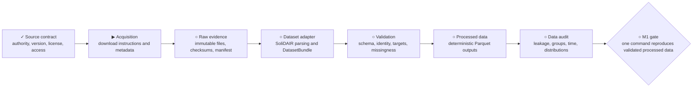

# M1 — SoliDAIR ingestion

**Status:** `◐ In progress`

**Objective:** reproducibly acquire, validate, transform, and audit the authoritative
SoliDAIR distribution without committing third-party data.



## Scope and starting point

M1 delivers the SoliDAIR data foundation for the predictive-quality MVP. The
[technical specification](../plans/Manufacturing%20Quality%20%26%20Process%20Intelligence%20%E2%80%94%20Greenfield%20Technical%20Specification%20%26%20Implementation%20Plan.md)
owns scope, particularly sections 17–21 and Milestone 1. This document translates
that scope into execution order and evidence needed for completion.

M0 supplies the Python/uv environment, package, CLI shell, configuration, logging,
tests, and CI. The SoliDAIR configuration remains disabled with no source URL and
an `unacquired` version. Source-contract discovery is complete and establishes the
facts linked below; acquisition and ingestion implementation have not started.

Included: source verification, acquisition, provenance, dataset-specific parsing,
validation, deterministic Parquet outputs, and a reproducible data audit.

Excluded: train/test split implementation, fitted preprocessing, baselines,
modeling, uncertainty estimation, inspection policies, dashboards, other dataset
adapters, and production services. M1 records evidence needed by M2 to choose
splits and prevent leakage; M2 implements those decisions.

## Subsystem plan

| Subsystem | Responsibility and deliverable | Depends on | Completion evidence |
| --- | --- | --- | --- |
| Source contract | Verify authoritative distribution, release/version, access requirements, license, and raw/derived redistribution terms. Inspect a sample and record file inventory, unit identity, target meaning, measurement units, and simulation/production provenance. | M0 | Cited source notes, license record, and sample inventory; consequential unknowns are resolved or explicitly constrain the usable scope. |
| Acquisition | Provide documented acquisition through `mqi data pull solidair`, using automated download where permitted or actionable manual-placement instructions where required. | Source contract | The supported acquisition path obtains the selected release; missing access, missing files, and failed downloads cannot report success. |
| Raw evidence | Preserve acquired files unchanged; record source, version, acquisition date, file inventory, sizes, and cryptographic hashes in a manifest. | Acquisition | Every input used by preparation is accounted for and hash-verified; reruns reuse matching inputs and identify mismatches. |
| Dataset adapter | Parse SoliDAIR into its declared `DatasetBundle` portion: `units`, `process_features`, `quality`, and `metadata`. Keep source-specific semantics in the adapter. | Verified sample and raw evidence | Synthetic contract fixtures prove identity and target mappings; a real-data run produces the declared bundle without silent row loss or unsupported semantics. |
| Validation | Check source structure and canonical schema, keys, joins, types, target validity, and declared missing-value rules. Separate fatal contract violations from audit findings. | Adapter contract | Valid fixtures pass; malformed and inconsistent inputs fail with actionable diagnostics; real-data findings are accounted for. |
| Processed data | Write stable Parquet tables and provenance linking them to raw hashes, adapter version, preparation configuration, and schema. | Adapter and validation | Reloaded outputs preserve the contract; repeated preparation in the locked environment produces identical processed file hashes. |
| Data audit | Generate `artifacts/audit/solidair_report.html` or an equivalent reproducible report from validated data. | Processed data and metadata | Report covers the required audit topics below, identifies the input version/hashes, and documents implications for M2. |

Each row is a work package, not a detailed implementation checklist. Expand a
subsystem's steps immediately before implementing it, using discoveries from its
prerequisites. Keep the diagram brief and attach completion evidence here as work
finishes.

## Source-contract subsystem — detailed plan

**Status:** complete; ready for noncommercial-research acquisition and adapter
work with the documented limitations.

**Outcome:** give the acquisition and adapter implementer a source-backed account
of which SoliDAIR release to use, how it can be obtained and processed, and how
observations map to manufacturing units and quality measurements. The result must
separate verified facts, sample observations, proposed mappings, and unknowns.

This subsystem performs focused source research and sample inspection. Production
download commands, the final raw manifest pipeline, the adapter, full-data
validation, and the comprehensive audit remain in their owning work packages.
Sample acquisition here is discovery evidence, not completion of acquisition.

### Work sequence

1. **Establish source authority and release identity.** Locate the original
   publisher's dataset record and associated documentation or paper; follow their
   links to the distribution. Record the canonical landing page, persistent
   identifier if available, release/version, relevant file list, and access date.
   Prefer a publisher-linked distribution over an unverified mirror. If releases
   differ, compare their contents and select the one supporting the MVP's stated
   unit-to-quality use case; record the rationale. Do not invent a release number
   when the publisher provides none: use available record identity and file hashes
   and explain that versioning limitation.
2. **Verify access and terms before downloading.** Record authentication or manual
   steps, available file sizes, and the evidence for permitted download, local
   processing, and raw/derived redistribution. Distinguish dataset terms from a
   paper's or example code's license. Put verified dataset terms and references in
   `DATA_LICENSES.md`. If access or processing permission is unclear, retain the
   uncertainty and resolve it before the dependent acquisition; public visibility
   alone does not establish permission. Do not accept new agreements, pay for
   access, or contact third parties without the required user authorization.
3. **Acquire the smallest useful inspection set.** Choose files covering each
   distinct table/file role and the joins needed to trace a manufacturing unit to
   its quality measurement. Record why that set is sufficient for contract
   discovery, its limitations, original filenames, source URLs without credentials,
   acquisition date, sizes, and SHA-256 hashes. Preserve downloaded bytes under
   ignored local raw storage. Record any row selection used for inspection. If the
   distribution requires a whole archive, establish its size before acquisition
   and use selective inspection where practical.
4. **Inventory structure and trace meaning.** Record file formats, dimensions
   actually inspected, columns, observed types, documented units, missing-value
   encodings, candidate keys, duplicates, and observed join cardinalities. Trace
   at least one actual unit through process inputs to quality outputs, including
   repeated measurements or unmatched records if present. Distinguish source
   declarations from sample measurements; a sample cannot prove full-dataset
   uniqueness, completeness, or production provenance.
5. **Establish prediction-relevant semantics.** Identify documented quality
   characteristics, continuous targets, upstream process fields, downstream
   measurements, identifiers, and uncertain feature availability. Record evidence
   for production versus simulation, timestamp meaning, batch/lot/run grouping,
   and specification limits. Preserve distinctions between missing, unavailable,
   and unknown information. Do not derive pass/fail labels without authoritative
   limits or treat correlated fields as proof of causal meaning.
6. **Produce the contract handoff and readiness verdict.** Map verified source
   fields to the minimal `units`, `process_features`, `quality`, and `metadata`
   portions of `DatasetBundle`. Specify supported input coverage, identity and
   join rules, target units, missingness handling proposals, and fields requiring
   exclusion or further investigation. Name the acquisition method supported by
   the evidence and the remaining decisions for the adapter. Update the overall
   M1 plan only where findings change its assumptions or dependencies.

### Saved outputs and evidence

The discovery result is the
[SoliDAIR source contract](../datasets/solidair-source-contract.md). That document owns the source
references, selected-release rationale, inspection inventory, semantic mapping,
limitations, and readiness verdict. Keep this section as the work plan rather
than duplicating those findings. Source URLs and access dates must accompany
claims whose interpretation affects ingestion.

Save safe sample provenance under `data/manifests/`; downloaded files stay outside
Git. Keep any small inspection script needed to reproduce reported observations
in the repository and document its invocation and input hashes. Avoid committing
row-level sample excerpts or restricted metadata. Update `DATA_LICENSES.md` with
verified terms; leave dataset enablement and production acquisition settings to
the acquisition implementation.

### Acceptance and partial outcomes

- [x] The selected distribution is linked to authoritative publisher evidence and
  identified precisely enough to obtain the same inputs again, subject to stated
  upstream availability limitations.
- [x] Access and applicable dataset terms are documented; unresolved terms do not
  masquerade as permission.
- [x] The inspection inventory is tied to hashed files and reproducible inspection
  steps, with sample coverage clearly separated from full-dataset claims.
- [x] A real unit-to-quality trace supports the proposed identity and target
  mapping; observed conflicts or ambiguity are explained rather than silently
  dropped or resolved through invented identifiers.
- [x] Feature timing, units, targets, production/simulation provenance, groups,
  timestamps, and specification limits each have evidence or an explicit unknown
  or absence, with their impact on downstream work recorded.
- [x] The handoff gives acquisition and adapter work a usable input contract and
  records each remaining issue's impact, affected dependency, and resolution step.
- [x] The M1 diagram and evidence links reflect the actual readiness verdict.

Declare the source contract complete only when access/processing terms and a
meaningful unit-to-quality mapping are established for the selected scope.
Missing optional grouping/time fields or specification limits may remain explicit
limitations. Conflicting identity, unresolved target meaning, or uncertain
production/simulation provenance that affects the selected use case prevents the
dependent contract from being ready.

If only documentation is accessible, save that evidence and mark sample-dependent
claims unverified; the subsystem remains incomplete. If two authoritative sources
disagree, record both and resolve the conflict before dependent implementation.
If only simulation is available, record that fact and seek a scope decision rather
than presenting it as production data. A completed research note alone does not
establish readiness or close M1.

**Completion evidence:** the source contract selects Zenodo record 22300180's
production release, documents CC BY-NC-ND 4.0 boundaries, maps one row per injector
to five EoL characteristics, and records absent physical identity, time/group keys,
units, and specification limits. The version-controlled
[discovery manifest](../../data/manifests/solidair-source-discovery.json) ties a
complete streaming inspection to source sizes and MD5/SHA-256 hashes; the
reproducible stdlib script and synthetic tests emit no row records. All 510,050
production rows and 800 simulation rows were structurally scanned on 2026-09-12.

**Verification evidence (2026-09-12):** `uv run ruff check .` and
`uv run ruff format --check .` passed; Pyright reported 0 errors; pytest passed all
8 tests, including two synthetic inspection-script tests; `uv run mqi --version`
and `uv run mqi --help` passed. The real-data inspection verified upstream sizes
and MD5 values before recording local SHA-256 values. Git ignore checks kept raw
PDF/CSV bytes and the generated inspection report outside the Git-visible set;
`git diff --check` passed.

**Next action:** detail the acquisition subsystem before implementing it. Source
discovery does not claim acquisition, adapter, validation, processed-data, audit,
or overall M1 completion.

## Execution sequence and decision points

1. **Discover the source and inspect a sample.** Establish authority, release,
   access, terms, file layout, dimensions, identifiers, targets, and provenance.
   Distinguish real production from simulation. Record upstream process fields,
   downstream measurements, suspicious identifiers, and available time/group
   fields. Confirm whether authoritative specification limits exist.
2. **Record the ingestion contract.** Select the supported release and input
   subset. Define table keys, join cardinalities, target representation, units,
   missingness policy, and metadata from evidence. Settle acquisition behavior,
   local layout, manifest fields, and deterministic output rules. Update this
   plan where discovery changes assumptions before detailing downstream work.
3. **Build acquisition and raw provenance.** Exercise the supported path with
   actual source files. Establish rerun behavior and handling of incomplete or
   changed inputs before preparation consumes them.
4. **Complete one preparation path.** Implement the minimal SoliDAIR bundle,
   validation, and Parquet persistence together. Verify the actual CLI-to-output
   handoff, synthetic failure cases, and real-data contract compliance.
5. **Produce the audit and M2 handoff.** Review findings and document unresolved
   limitations, candidate targets/features, and evidence for chronological or
   grouped evaluation. Do not infer chronology from row order or fabricate groups.
6. **Run the milestone gate.** Reproduce preparation from the documented starting
   state, repeat in an isolated output location, compare hashes, and record the
   commands, input identity, results, and remaining limitations.

Source/access/license uncertainty is an initial dependency, not a verified blocker.
If evidence prevents lawful acquisition or a meaningful unit-to-quality mapping,
record the specific blocker and seek a scope decision before substituting a dataset.
Absent optional time/group fields or specification limits must be recorded as
limitations; they must not be manufactured to satisfy the contract.

## Interfaces and artifact ownership

The intended public commands follow the technical specification:

```text
uv run mqi data pull solidair
uv run mqi data prepare solidair
uv run mqi audit solidair
```

These commands are planned, not yet implemented. `data pull` owns acquisition;
`data prepare` owns raw verification, parsing, validation, and processed output;
`audit` consumes validated processed data and its metadata. Failed prerequisites
must yield a nonzero exit and an actionable explanation. Failed preparation must
not leave partial output labeled as a completed dataset.

The single-command reproduction gate is `uv run mqi data prepare solidair` once
the documented acquisition prerequisite is satisfied. Separately verify the
complete acquisition-to-audit sequence starting with no local SoliDAIR data.
If access requires manual download, document that prerequisite explicitly; do not
describe the workflow as an unattended download from an empty directory.

| Location | Planned contents |
| --- | --- |
| `src/mqi/` | Adapter, minimal bundle contract, validation, preparation, audit, and CLI integration; exact module boundaries settled when implementing. |
| `configs/datasets/solidair.yaml` | Verified source/version and preparation settings; enable only when supported. |
| `DATA_LICENSES.md` and dataset documentation under `docs/` | Source citations, access and redistribution terms, data dictionary, acquisition/preparation instructions, and limitations. |
| `data/raw/solidair/` | Unmodified local source files, outside Git. |
| `data/processed/solidair/` | Validated local Parquet outputs, outside Git. |
| `data/manifests/` | Version-controlled provenance and hashes, without credentials or machine-specific private paths. |
| `artifacts/audit/` | Generated local audit report, outside Git. |
| `tests/` | Small synthetic fixtures and contract/integration tests; no downloaded dataset dependency in CI. |

The manifest must include dataset name/version, source, download date, raw and
processed file hashes, adapter version, row/column counts, and preparation settings.
Record split strategy as not yet implemented in M1, with available split evidence;
M2 owns selection and implementation. Keep run-specific timestamps out of
deterministic table content; provenance timestamps may differ between acquisitions.
Pin and record the environment needed for byte-identical Parquet reproduction.

## Audit coverage and handoff to M2

The report must cover dimensions, feature types, target definitions, missingness,
constant/near-constant features, duplicate observations, feature and target
distributions, high correlations, potential target leakage, suspicious identifiers,
simulation versus production distinctions, and available grouping/time variables.

Document each field's known meaning and availability where evidence exists. Flag
unknown timing or provenance explicitly. Preserve original observations; any
filtering, deduplication, coercion, or missing-value treatment requires a documented
rule and counts showing its effect. Do not fit imputation, scaling, or feature
selection across the dataset in M1.

The M2 handoff identifies supported quality targets, candidate upstream features,
fields to exclude or investigate for leakage, available grouping/time keys,
specification-limit availability, and unresolved validity risks. Recommendations
about splits must distinguish source evidence from assumptions.

## Acceptance gate and progress evidence

M1 is complete only when all of the following are verified:

- [ ] Source identity, selected release, access, license, and redistribution terms
  are documented with authoritative references.
- [ ] Acquisition from an empty local SoliDAIR data directory succeeds by the
  documented supported procedure, including any explicit manual prerequisite.
- [ ] Raw files remain unchanged and all consumed inputs have verified hashes.
- [ ] One preparation command produces validated, reloadable Parquet outputs and
  a manifest tying them to raw inputs, adapter, configuration, and environment.
- [ ] Repeating preparation with identical inputs/settings in the locked
  environment produces identical processed hashes in an isolated output location.
- [ ] Contract tests cover identity, joins, target mappings, missingness rules,
  malformed inputs, and observable failure/rerun behavior.
- [ ] The audit is reproducible and covers every required topic, with explicit
  limitations and a usable M2 handoff.
- [ ] Required Ruff lint/format, Pyright, pytest, and CLI smoke checks pass; CI uses
  synthetic data and does not require external downloads or training.
- [ ] Git changes contain only permitted documentation, code, configuration,
  manifests, and synthetic fixtures; generated data and reports remain outside Git.
- [ ] Gate evidence records the tested commit, commands, source/input hashes,
  processed hash comparison, report location, and check results.

Current evidence: the source-contract subsystem is complete; all later subsystems
and the end-to-end M1 gate remain open. Update the subsystem diagram as execution
progresses. The
[implementation roadmap](../implementation-roadmap.md) owns cross-milestone status;
mark M1 complete there only after this gate passes.
