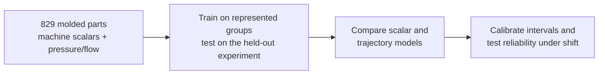
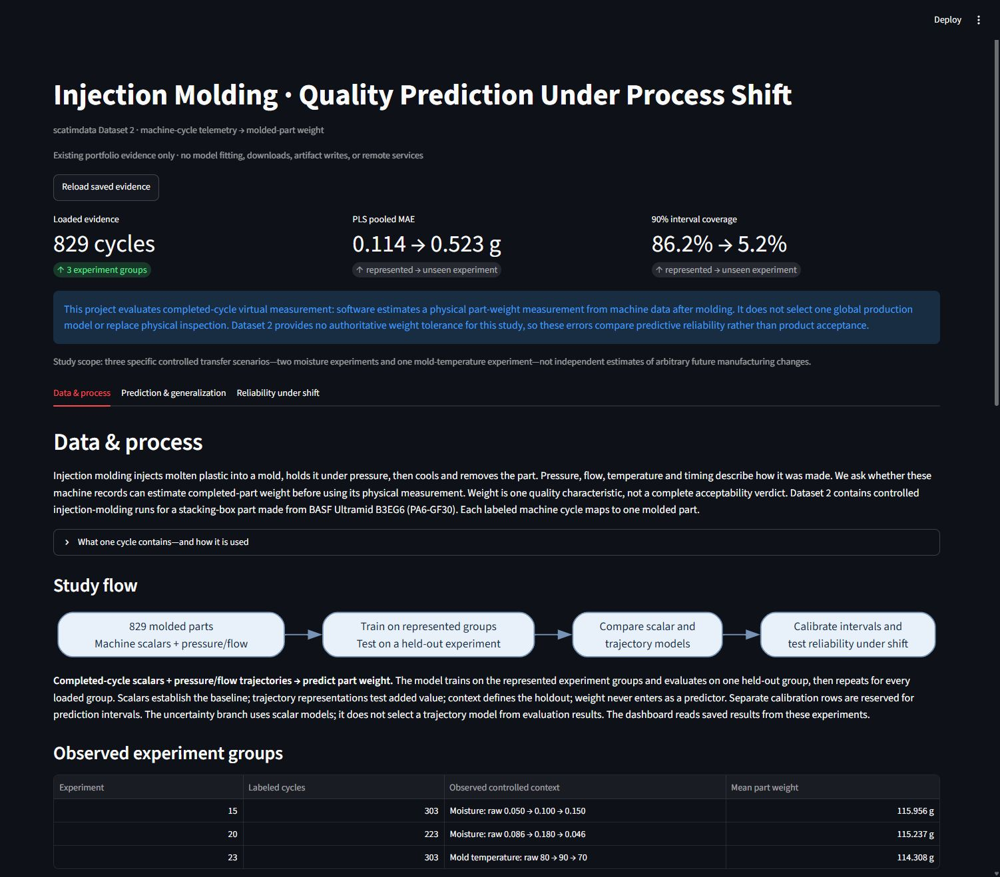
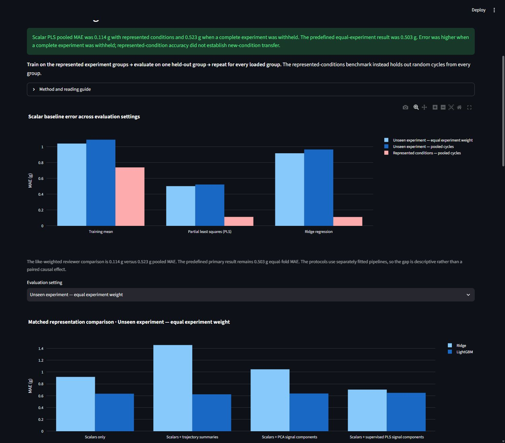
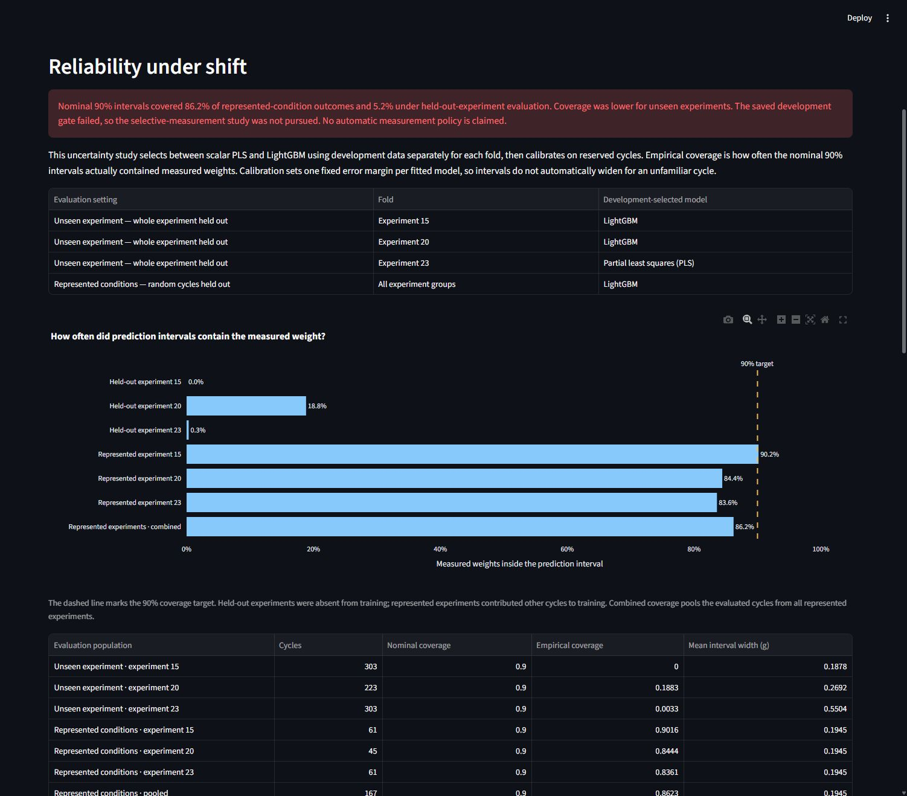

# Manufacturing Process & Quality Intelligence

A manufacturing data-science portfolio investigating a focused question:
does high-resolution machine telemetry improve part-weight prediction beyond
scalar measurements, and does it generalize under controlled process changes?

This is a personal résumé/portfolio project: rigorous analysis, reproducible local
commands and an understandable demo, not a production-grade factory service.

## Result at a glance

**Problem:** Can ordinary injection-molding telemetry estimate completed-part weight,
and does that accuracy hold when process conditions change?

**Result:** With all experiment groups represented during training, scalar PLS reached
**0.114 g pooled MAE**. When a complete experiment was withheld, the like-weighted pooled
MAE was **0.523 g**. Nominal 90% interval coverage fell from **86.2%** to **5.2%**.
Richer pressure/flow representations sometimes helped, but not consistently across the
three held-out conditions.

**Practical implication:** Validation design and labeled operating-condition coverage
mattered more than additional model or signal complexity. The simple uncertainty screen
failed its development gate, so this project does not claim that physical measurement can
safely be skipped.





MAE is average absolute prediction error in grams; lower is better. Both headline errors
above pool cycles, so their weighting is comparable. The predefined primary scientific
metric was **0.503 g equal-experiment MAE**, reported separately in the technical results.
The represented-condition and held-out-condition values come from separately fitted
pipelines, not a paired causal estimate of shift.

Dataset 2 provides no authoritative weight specification or tolerance for this study, so
neither 0.1 g nor 0.5 g MAE can be interpreted as product acceptance or production
adequacy. These are three specific controlled transfer scenarios—two moisture experiments
and one mold-temperature experiment—not independent estimates of arbitrary future factory
changes.

## Dataset and experiment at a glance

Injection molding injects molten plastic into a mold, holds it under pressure, then
cools and removes the part. Machine pressure, flow, temperature and timing describe
how it was made. This experiment asks whether those records can estimate its weight
after the cycle, before using the physical weight measurement. Weight is one quality
characteristic, not a complete verdict on whether a part is acceptable.

The project uses **scatimdata Dataset 2**: controlled injection-molding runs for a
stacking-box part made from BASF Ultramid B3EG6 (PA6-GF30). Each labeled machine cycle
maps to one molded part.

| Data available for each labeled cycle | How this project uses it |
| --- | --- |
| Scalar machine measurements | Sixteen completed-cycle variables, such as injection time, maximum pressure and barrel temperatures, form the scalar baseline. |
| Injection-pressure and injection-flow trajectories | Each channel has 2,048 native-time samples; engineered and compressed representations test whether signal shape adds transferable information. |
| Experimental context | Experiment boundary plus nullable moisture, mold-temperature and charge context describe controlled conditions; they organize analysis and validation but are not default predictors. |
| Physical quality measurements | Part weight in grams is the required target. Three geometry fields remain deferred because their released scale/mapping is not authoritative. |

There are 829 labeled cycles. Another 92 released signal-only cycles are excluded because
they have no matching released scalar/quality row and therefore no supported weight target.

### How the three experiments differ

| Source experiment | Labeled cycles | Observed controlled context | Mean weight | Distinguishing evidence |
| ---: | ---: | --- | ---: | --- |
| 15 | 303 | Moisture runs at raw 0.050 → 0.100 → 0.150 | 115.956 g | Highest mean weight; the first two released moisture values differ from the paper and remain unresolved. |
| 20 | 223 | Moisture runs at raw 0.086 → 0.180 → 0.046 | 115.237 g | Broader cycle-to-cycle pressure/flow-summary variation than experiment 23. |
| 23 | 303 | Mold-temperature runs at raw 80 → 90 → 70 | 114.308 g | Lowest and narrowest weight distribution; higher mean pressure and lower mean flow than experiments 15/20. |

Each experiment contains several intervention settings. Validation withholds the whole
experiment, including all its settings and cycles. The temperature values are consistent
with the paper's °C settings, but that unit mapping remains inferred.
These are source experiment groups, not verified production-day labels. The context runs
describe deliberate interventions, but other process measurements move with them; the
observed differences do not establish that moisture or mold temperature alone caused the
weight changes.

### How the data becomes an experiment

The 16 scalars establish the baseline. Engineered and compressed trajectories test whether
dynamic signal shape improves it. Weight is never used as an input. Experimental context
defines the held-out groups rather than silently entering the model. Separate calibration
rows estimate prediction intervals after model fitting.
The uncertainty branch uses scalar models; it does not select a trajectory model from
the evaluation results. All dashboard charts read saved outputs from these experiments.
The [dashboard milestone](docs/milestones/m10-dashboard.md#technical-study-flow) retains
the detailed study flow and evaluation boundaries.

## What this project found

The models predict completed-part weight well on randomly held-out cycles from experiment
groups represented during training. Accuracy degrades when a whole experiment is withheld.
Neighboring cycles can resemble one another, so the random-cycle benchmark may be optimistic
for later production. The gap between these two evaluations is the central result.
The represented-group benchmark is called secondary in-distribution (ID) evaluation.
The primary benchmark is retrospective grouped cross-validation: the initial audit
examined all three experiments, so these are not untouched prospective tests.

| Evidence | All experiment groups represented | Entire experiment held out |
| --- | ---: | ---: |
| Scalar PLS MAE | 0.114 g pooled | 0.523 g pooled |
| Nominal 90% interval coverage | 86.2% pooled | 5.2% pooled |
| Pressure/flow trajectory benefit | Useful in some comparisons | Inconsistent across conditions |

MAE is the average absolute prediction error in grams; smaller is better. The like-weighted
pooled comparison above gives each cycle equal weight. The predefined primary headline was
0.503 g and gives each held-out experiment equal weight. PLS predicts through a small set of components learned from correlated inputs
and measured weights. For the separate uncertainty study, development data select PLS
or LightGBM for each fold before reserved cycles calibrate the intervals. Thus the
coverage row does not describe a PLS-only study. Coverage is the fraction of measured
weights inside their intervals; a nominal 90% interval aims to contain nine in ten
outcomes under its assumptions.

The held-out experiments frequently extended beyond process-variable ranges seen during
fitting, so the models faced extrapolation pressure. That shift co-occurs with the errors;
this experiment does not prove that range departure alone caused them.
About **70.45% of observed weight variation was between the three experiment groups**.
That large group separation can make pooled validation—especially pooled R²—look much
stronger when all conditions are represented, motivating the whole-experiment holdout.

The [original study](https://pmc.ncbi.nlm.nih.gov/articles/PMC9959070/) used repeated
random cross-validation and asked whether high-resolution pressure and flow improve
prediction within the available mixture of conditions. This project asks a harder
transfer question by withholding a complete experiment. Its feature and model setup
also differs, so this is an extension rather than an exact replication. The results
support different claims and do not contradict the paper.

### What was learned

- **Validation design changes the conclusion.** Excellent pooled performance partly
  reflected separation between conditions and did not imply reliable transfer.
- **Complexity did not replace condition coverage.** Scalar PLS had the lowest grouped
  aggregate error among the predefined comparisons; LightGBM and additional trajectory
  representations did not improve every held-out condition.
- **The worst failure was systematic.** Scalar PLS underpredicted every experiment-23
  part by 0.798 g on average, while intervals averaging 0.550 g wide covered only 0.3%.
- **Predictive explanations were population-specific.** Correlated temperature channels
  often acted as condition proxies, and the most important feature changed across evaluated
  populations; no universal or causal sensor ranking was established.
- **Input novelty is not the same as prediction risk.** A cycle can look unfamiliar
  without a simple distance score reliably identifying whether its weight prediction
  will be wrong.

This project evaluates **completed-cycle virtual measurement**: software estimates a
physical part-weight measurement from machine data after molding. It does not select one
global production model and is not an early-cycle controller, root-cause model,
product-conformance decision, setting recommender or validated replacement for physical
measurement.

### Why the selective-measurement gate stopped

The uncertainty study tested one deliberately simple score: mean distance to the five nearest training
cycles in standardized scalar-process space. Before final evaluation, retaining the
closest 75% of development predictions had to reduce MAE by at least 10% in every fold.

| Future held-out experiment | Development MAE reduction | Decision |
| --- | ---: | --- |
| Experiment 15 | 19.66% | Pass |
| Experiment 20 | 4.31% | **Fail** |
| Experiment 23 | 16.31% | Pass |

Because one fold failed, the project did not create a risk-coverage curve or claim that
physical measurement could safely be skipped. The pre-specified study stopped after this
failed screen; a separately designed follow-up could evaluate other warning methods.
Observed input-range departures are evidence of unfamiliar inputs, but do not establish
reliable error ranking or a working temporal drift detector.

### What to do next

1. **Expand the labeled operating envelope.** Sample its boundaries, interior and
   important combinations across material lots, recipes, machines and process settings;
   more diverse conditions matter more than more cycles from one familiar setup.
2. **Keep condition-held-out validation.** Hold out complete conditions, lots or machines
   so within-condition accuracy cannot conceal transfer failure.
3. **Validate guardrails prospectively.** Warn when inputs approach or leave the supported
   envelope, physically measure unsupported cases, and use those outcomes to test errors,
   interval coverage and recalibration before automating any measurement decision.

<details>
<summary>Future monitoring and intended-use controls</summary>

An input-drift warning means the model may be outside its validated use; it does not mean
the part is defective. Data-quality, operating-context and process-distribution changes
could be checked when inputs arrive. Actual performance and interval-calibration drift require
later measured weights. This dataset lacks authoritative wall-clock chronology, so it
cannot validate temporal drift detection or warning delay.

A future system could distinguish **represented**, **boundary/drift warning** and
**unsupported** operation, but thresholds must be selected on development data and
validated prospectively. It would also need an enforceable intended-use contract covering
the supported machine, mold, material and target; required inputs and units; operating
envelope; validated performance; calibration date; measurement policy; and refusal rules.

The intended loop is: **build the envelope → predict inside it → warn near or outside it
→ physically measure unsupported cases → expand and recalibrate**.

</details>

### Dashboard preview

**Data and process:** three controlled experiments, linked to physical part weight.


<details>
<summary>Prediction: within-regime accuracy versus unseen-experiment generalization</summary>



</details>

<details>
<summary>Reliability: nominal versus observed interval coverage</summary>



</details>

Screenshots show this project's analysis and visualization of **scatimdata Dataset 2**,
by Bogedale et al., from the [pinned source](https://github.com/sc4t1m/scatimdata/tree/7bd35941d75c97a3f276439377dc430ab47402be),
licensed [CC BY 4.0](https://creativecommons.org/licenses/by/4.0/).
The source data were transformed into English-named canonical tables and analyzed
by this project; these are not publisher figures. See [data licensing](DATA_LICENSES.md)
and [local dashboard instructions](#run-the-dataset-2-dashboard).

The completed study includes reproducible ingestion, audit, scalar and trajectory
comparisons, uncertainty, predictive explanation and this dashboard. Selective
measurement was skipped after its prerequisite failed.

See the [implementation roadmap](docs/implementation-roadmap.md) for the current
milestone, subsystem status, and acceptance gates. The
[project specification](docs/spec.md)
is the canonical scope authority.

## Development setup

Prerequisites:

- Python 3.12
- [uv](https://docs.astral.sh/uv/)
- Git

```powershell
uv sync --locked --group dev
uv run mpi --version
uv run pytest
uv run ruff check .
uv run ruff format --check .
uv run pyright
```

Install the Git hooks after syncing:

```powershell
uv run pre-commit install
```

## Command line interface

```powershell
uv run mpi --help
uv run mpi data acquire injection_molding
uv run mpi data validate injection_molding
uv run mpi data prepare injection_molding --raw-root data/raw/injection_molding
```

The acquisition command downloads only the manifest-admitted Dataset 2 archive to
`data/raw/injection_molding/` and verifies its exact size and SHA-256 before saving.
Use `--raw-root <directory>` for an isolated destination. A matching
archive is verified and reused without network access. A mismatched archive is
preserved and reported; move or remove it manually only after investigating its
identity. Acquisition does not extract, parse, validate, or prepare the dataset.

The validation command is local-only. It rechecks the acquired bytes before safely
reading the single pinned HDF5 member, validates the complete scalar, pressure, and
flow source contract, and reports labeled and signal-only membership plus accepted
limitations. It does not canonicalize, resample, impute, or prepare data.

The preparation command is offline. For a new output it validates the pinned raw
source, canonicalizes it, and writes six Parquet tables plus `metadata.json`.
Metadata retains source identity, license, field lineage, transformations,
exclusions and limitations; the source contract owns research evidence.
The source manifest is the sole source identity; edits to its descriptive notes do
not invalidate prepared data. The default output is `data/processed/injection_molding/dataset2`.

An existing output is loaded after schema and manifest-pinned source checks, without
reprocessing raw data or writing files. Reuse is not a code-freshness check: after
changing transformations, explicitly remove the generated output or choose a new
`--output` directory. Existing files are never overwritten. An interrupted write
may leave an incomplete directory; inspect/remove it or choose another output.
Only the current schema is supported; there are no artifact manifests or compatibility readers.
Both raw and prepared data remain outside Git.

## Reproduce the full study

After preparing Dataset 2 at the default path, the complete saved-evidence sequence is:

```powershell
New-Item -ItemType Directory -Force artifacts/m02 | Out-Null
uv run jupyter nbconvert --to notebook --execute notebooks/m02_injection_molding_audit.ipynb `
  --output m02_injection_molding_audit.executed.ipynb --output-dir artifacts/m02 `
  --ExecutePreprocessor.timeout=300
uv run python scripts/create_injection_molding_memberships.py
uv run python scripts/run_scalar_baselines.py
uv run python scripts/run_trajectory_representations.py
uv run python scripts/run_lightgbm_comparison.py
uv run python scripts/run_uncertainty_shift.py
uv run python scripts/run_predictive_explanation.py
uv run streamlit run src/mpi/dashboard.py --browser.gatherUsageStats false
```

<details>
<summary>Per-step methodology, outputs and special commands</summary>

The following notes link each step to its detailed methodology and limitations.

### Exploratory audit

After preparing Dataset 2 at the default path, execute the bounded audit headlessly:

```powershell
New-Item -ItemType Directory -Force artifacts/m02 | Out-Null
uv run jupyter nbconvert --to notebook --execute notebooks/m02_injection_molding_audit.ipynb `
  --output m02_injection_molding_audit.executed.ipynb --output-dir artifacts/m02 `
  --ExecutePreprocessor.timeout=300
```

The executed copy is generated under ignored `artifacts/`; the tracked notebook
has no outputs. The audit is descriptive and does not approve a prediction cutoff,
feature allowlist, split, model, or trajectory representation. See the
[M2 audit summary](docs/milestones/m02-dataset-audit.md) for aggregate findings
and the [M3 contract](docs/milestones/m03-feature-and-evaluation-contract.md) for the
subsequently fixed modeling decisions.

### Fixed evaluation memberships

After preparing Dataset 2 at the default path, generate the ignored membership
artifact shared by the scalar and trajectory experiments:

```powershell
uv run python scripts/create_injection_molding_memberships.py
```

The command writes `artifacts/m03/injection_molding_memberships.parquet`. It records
the source hash, protocol, fold, experiment, role, inner fold, seed and exact unit
identity. Re-running it is deterministic for the locked environment and does not
modify the prepared bundle. The [M3 contract](docs/milestones/m03-feature-and-evaluation-contract.md)
owns the cutoff, predictor allowlist, allocation rules and limitations.

### Scalar baselines

After preparing Dataset 2 and generating the M3 memberships, run:

```powershell
uv run python scripts/run_scalar_baselines.py
```

The command evaluates Mean, Ridge and PLS on all three grouped primary folds and
the separate secondary ID fold. It writes ignored predictions, metrics and a run
record under `artifacts/m04/`. Primary equal-fold mean MAEs are 1.041300 g for
Mean, 0.918559 g for Ridge and 0.502668 g for PLS; pooled sample-weighted MAEs are
1.090584 g, 0.966475 g and 0.523299 g, respectively. Performance varies strongly
by held-out experiment and includes negative R² values. The much lower separate ID
errors are descriptive, not a paired estimate of shift. See the
[M4 results and limitations](docs/milestones/m04-scalar-baselines.md).

The pooled ID result combines represented regimes; per-experiment ID metrics and
post-hoc signed errors are recorded in `run.json` and the M4 results. To refresh
only these diagnostics from saved predictions, without retraining:

```powershell
uv run python scripts/run_scalar_baselines.py --report-only
```

### Trajectory comparison

After preparing Dataset 2 and generating the M3 memberships, run:

```powershell
uv run python scripts/run_trajectory_representations.py
```

The command evaluates the pre-specified A scalar, B engineered-summary, C-PCA and
C-PLS representations with fold-local transformations and Ridge. It writes ignored
predictions, metrics and a run record under `artifacts/m05/`. Primary equal-fold
mean MAEs are 0.918559 g for A, 1.457393 g for B, 1.046989 g for C-PCA and
0.704219 g for C-PLS. The result is heterogeneous: each augmented representation
is worse than A on at least one held-out experiment, and no representation is
selected from its outer score. See the
[M5 results and limitations](docs/milestones/m05-trajectory-representations.md).

### LightGBM comparison

After preparing Dataset 2 and generating the M3 memberships, run:

```powershell
uv run python scripts/run_lightgbm_comparison.py
```

The command evaluates the same A, B, C-PCA and C-PLS representations with the
pre-specified bounded LightGBM search. It writes ignored predictions, all 16
fold/representation metric rows and the full run record under `artifacts/m06/`.
Primary equal-fold mean MAEs are 0.634726 g for A, 0.624374 g for B, 0.637934 g
for C-PCA and 0.649260 g for C-PLS. B's small aggregate improvement is not
consistent across held-out experiments, compression does not improve the aggregate
LightGBM result, and no global winner is selected from outer performance. See the
[M6 results and limitations](docs/milestones/m06-lightgbm-comparison.md).

### Uncertainty evaluation

After preparing Dataset 2 and generating the M3 memberships, run:

```powershell
uv run python scripts/run_uncertainty_shift.py
```

The command performs fixed development-only scalar PLS/LightGBM selection, 90%
split-conformal calibration and the five-neighbor distance screen. Under primary
experiment shift, pooled coverage is only 0.052 versus 0.862 for the separate ID
protocol. The distance screen fails its pre-specified every-fold gate because one
primary fold improves development MAE by only 4.31%; M8 is therefore skipped, with
no additional score search. See the
[M7 results and limitations](docs/milestones/m07-uncertainty-and-shift.md).

### Predictive explanation

After reproducing M7, run:

```powershell
uv run python scripts/run_predictive_explanation.py
```

The command reads M7's four selected scalar-model settings, refits each model once
on its original fit/tune rows, and verifies its unit-aligned predictions against
the saved M7 evaluation predictions. It writes ignored 96-row permutation-importance
and marginal feature-support tables plus a compact run record under `artifacts/m09/`.
The six populations keep each primary holdout and each secondary ID experiment
separate. These diagnostics describe fitted-model associations and observed marginal
support, not physical causes or product limits. See the
[M9 results and limitations](docs/milestones/m09-predictive-explanation.md).

### Run the Dataset 2 dashboard

After preparing Dataset 2 and reproducing M4-M7 and M9 at their default artifact
paths, launch the offline portfolio dashboard from the repository root:

```powershell
uv run streamlit run src/mpi/dashboard.py --browser.gatherUsageStats false
```

The three tabs present the saved data/process, prediction/generalization, and
reliability-under-shift evidence. Dashboard use does not fit models, download data,
write artifacts or call remote services; the documented command also disables
Streamlit usage telemetry. If a required input is absent, the page
lists the missing paths and the existing reproduction commands. Weight is shown in
grams; pressure and flow amplitudes remain in unresolved source-native units.
Inputs are cached between interactions. After regenerating artifacts, click
**Reload saved evidence** (or restart Streamlit). Loading checks that the milestone
run records share the prepared source and M3 membership identity; it does not
re-hash every Parquet or detect files changed while a cached snapshot is displayed.

</details>

## Data policy

Raw, interim, and processed third-party data are local-only and ignored by Git.
Version-controlled manifests in `data/manifests/` record admitted-source provenance
and hashes. See [DATA_LICENSES.md](DATA_LICENSES.md) before acquiring or redistributing
any dataset.

## Scope

The project follows this progression:

```text
predict -> test generalization -> quantify uncertainty -> selectively measure if supported
        -> detect abnormalities -> diagnose supported contributors -> transfer
```

After the MVP: audit PyScrew versus CiP-DMD and the cross-process-chain candidate
for process/assembly intelligence (v0.2), prioritize Bosch Plasma semiconductor
transfer (v0.3), then an optional role-specific engineering demo (v0.4). Pharma (v0.5) and advanced
manufacturing (v0.6) are optional later extensions. These are planned capabilities,
not implemented results; SPC and physical RCA are not Dataset 2 MVP requirements.

The core excludes predictive maintenance, computer vision, distributed
infrastructure, agentic AI, and autonomous process control until the defined
quality-intelligence milestones are complete.

## Status

See the [roadmap](docs/implementation-roadmap.md) for the next action and the
[M1 summary](docs/milestones/m01-injection-molding-ingestion.md) for completion
evidence. M2 and M3 are complete: the audit, retrospective cutoff, explicit feature
allowlist and evaluation memberships are reviewed. M4 scalar baselines, M5's fixed
trajectory comparison, M6's bounded LightGBM comparison, M7's conformal/shift
evaluation, M9's bounded predictive explanation, and M10's three-tab offline
dashboard are complete. M7's simple distance score failed the pre-specified gate,
so M8 remains skipped; the dashboard does not invent a selective-measurement policy.
The current data contract has no legacy readers or migration paths. Version labels
are not bumped for routine edits; historical versions become useful when there are
data or results worth retaining across changes.
