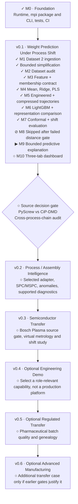

# Implementation roadmap

This is the concise status view of the
[project specification](spec.md).
The plan owns scope and acceptance criteria; this roadmap owns current position.

**Current position:** Milestones 0 and 1 are complete. The injection-molding source
contract, reproducible Dataset 2 acquisition, raw validation, canonicalization and
local Parquet/JSON save/load are verified. See the
[M1 summary](milestones/m01-injection-molding-ingestion.md) for the current data
contract and evidence.
The [bounded M2 audit](milestones/m02-dataset-audit.md) is complete and reviewed.
Its descriptive findings confirm substantial experiment shift. The
[M3 feature and evaluation contract](milestones/m03-feature-and-evaluation-contract.md)
and [M4 scalar baselines](milestones/m04-scalar-baselines.md) are complete and reviewed.
The bounded [M5 trajectory comparison](milestones/m05-trajectory-representations.md),
[M6 LightGBM comparison](milestones/m06-lightgbm-comparison.md) and
[M7 uncertainty/shift evaluation](milestones/m07-uncertainty-and-shift.md) are
complete. Primary interval coverage was poor and the simple distance score failed
its development gate, so M8 is skipped. M9 bounded predictive explanation is next.
The adapter retains all admitted source evidence
while enforcing the weight-only MVP policy boundary.
The [all-candidate source refresh](datasets/injection-molding-source-contract.md#all-candidate-evidence-refresh--2026-09-12)
has been incorporated into that plan; Dataset 1/3 remain inspected, not admitted.

**Accepted scope:** v0.1 tests Dataset 2 part-weight prediction under experiment
shift: scalar versus engineered/compressed trajectories, conformal uncertainty
and, if a simple score supports error ranking, AUTO-PREDICT / MEASURE. Geometry is retained but deferred, and SPC/physical
diagnostics are outside this MVP. Leave-one-experiment-out is the primary benchmark;
M3 now fixes its retrospective completed-cycle cutoff, feature allowlist and
leakage-safe calibration/tuning memberships before M4.

## Status key

- `✓` complete and verified
- `▶` next milestone or subsystem
- `◐` in progress
- `○` planned
- `⚠` blocked

Apply at a credible v0.1 (target week 6); later source audits and the semiconductor
case study strengthen the story. Semiconductor work can be prioritized for an
interview once prerequisites pass, without requiring productionization first.
Pharma/advanced manufacturing are optional in the first three months. The
[specification](spec.md#delivery-priorities) owns the relative 12-week schedule. SoliDAIR is retired
from the required core. No new source is admitted by this roadmap.

## Milestone drill-downs

- [M0 — Repository foundation](milestones/m00-foundation.md)
- [M1 — Injection-molding source contract and ingestion](milestones/m01-injection-molding-ingestion.md)
- [M2 — Bounded Dataset 2 audit](milestones/m02-dataset-audit.md)
- [M3 — Feature and evaluation contract](milestones/m03-feature-and-evaluation-contract.md)
- [M4 — Scalar weight-prediction baselines](milestones/m04-scalar-baselines.md)
- [M5 — Trajectory representations](milestones/m05-trajectory-representations.md)
- [M6 — LightGBM representation comparison](milestones/m06-lightgbm-comparison.md)
- [M7 — Uncertainty under experiment shift](milestones/m07-uncertainty-and-shift.md)

[AGENTS.md](../AGENTS.md) contains the compact planning/engineering guidance.
These diagrams summarize readiness; milestone documents hold relevant evidence.
