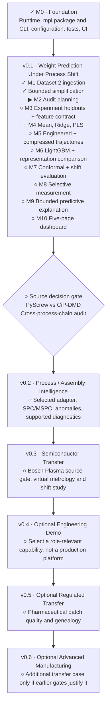

# Implementation roadmap

This is the concise status view of the
[project specification](spec.md).
The plan owns scope and acceptance criteria; this roadmap owns current position.

**Current position:** Milestones 0 and 1 are complete. The injection-molding source
contract, reproducible Dataset 2 acquisition, raw validation, canonicalization and
local Parquet/JSON save/load are verified. See the
[M1 summary](milestones/m01-injection-molding-ingestion.md) for the current data
contract and evidence.
M2 audit planning is next; M2 implementation has not begun.
The adapter retains all admitted source evidence
while enforcing the weight-only MVP policy boundary.
The [all-candidate source refresh](datasets/injection-molding-source-contract.md#all-candidate-evidence-refresh--2026-09-12)
has been incorporated into that plan; Dataset 1/3 remain inspected, not admitted.

**Accepted scope:** v0.1 tests Dataset 2 part-weight prediction under experiment
shift: scalar versus engineered/compressed trajectories, conformal uncertainty
and AUTO-PREDICT / MEASURE. Geometry is retained but deferred, and SPC/physical
diagnostics are outside this MVP. This revision changes plans, not completion
status. Leave-one-experiment-out is the primary benchmark; M3 must freeze its
cutoff, feature allowlist and leakage-safe calibration/tuning protocol before M4.

## Status key

- `✓` complete and verified
- `▶` next milestone or subsystem
- `◐` in progress
- `○` planned
- `⚠` blocked

Apply at a credible v0.1 (target week 6); later source audits and the semiconductor
case study strengthen the story. Semiconductor work can be prioritized for an
interview once prerequisites pass, without requiring productionization first.
Pharma/advanced manufacturing are optional in the first three months. The
[specification](spec.md#delivery-priorities) owns the relative 12-week schedule. SoliDAIR is retired
from the required core. No new source is admitted by this roadmap.

## Milestone drill-downs

- [M0 — Repository foundation](milestones/m00-foundation.md)
- [M1 — Injection-molding source contract and ingestion](milestones/m01-injection-molding-ingestion.md)

[AGENTS.md](../AGENTS.md) contains the compact planning/engineering guidance.
These diagrams summarize readiness; milestone documents hold relevant evidence.
