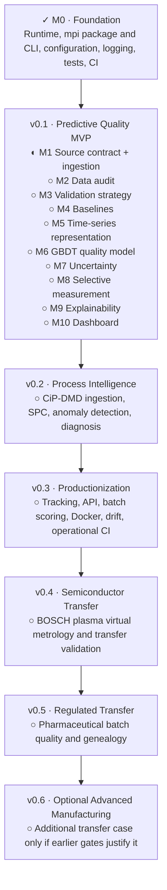

# Implementation roadmap

This is the concise status view of the
[canonical greenfield implementation plan](plans/Manufacturing%20Process%20%26%20Quality%20Intelligence%20%E2%80%94%20Greenfield%20Specification%20and%20Implementation%20Plan.md).
The plan owns scope and acceptance criteria; this roadmap owns current position.

**Current position:** Milestone 0 is complete. Milestone 1 is in progress: the
injection-molding source contract, reproducible Dataset 2 acquisition, and strict
raw validation are complete. Dataset 2 canonicalization is the next subsystem;
its [detailed plan](milestones/m01-injection-molding-ingestion.md#next-phase--canonicalization)
is saved and awaiting implementation authorization. Persistence remains deferred.

## Status key

- `✓` complete and verified
- `▶` next milestone or subsystem
- `◐` in progress
- `○` planned
- `⚠` blocked

## Milestone drill-downs

- [M0 — Repository foundation](milestones/m00-foundation.md)
- [M1 — Injection-molding source contract and ingestion](milestones/m01-injection-molding-ingestion.md)

The [planning and progression guide](agents/planning-and-progression.md) defines
when to expand milestone plans, how to track subsystem progress, and what evidence
is required to close a gate. These diagrams summarize readiness; linked milestone
documents hold execution details and evidence.
