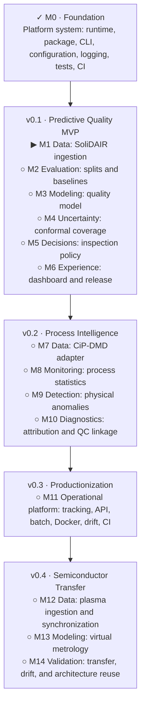

# Implementation roadmap

This is the concise status view of the
[greenfield implementation plan](plans/Manufacturing%20Quality%20%26%20Process%20Intelligence%20%E2%80%94%20Greenfield%20Technical%20Specification%20%26%20Implementation%20Plan.md).
The plan remains the authority for scope and acceptance criteria.

**Current position:** Milestone 0 is complete. Milestone 1 is next.

## Status key

- `✓` complete and verified
- `▶` next milestone or subsystem
- `◐` in progress
- `○` planned
- `⚠` blocked

## Milestone drill-downs

- [M0 — Repository foundation](milestones/m00-foundation.md)
- [M1 — SoliDAIR ingestion](milestones/m01-solidair-ingestion.md)

Create a later milestone drill-down only when that milestone is approaching. GitHub
Issues track individual tasks; these diagrams track subsystem readiness and gates.

## Updating status

Update this page and the active milestone diagram together. Change a subsystem to
`✓` only when its named artifact exists and its relevant verification passes. Mark
the milestone complete only when its acceptance gate passes end to end.
