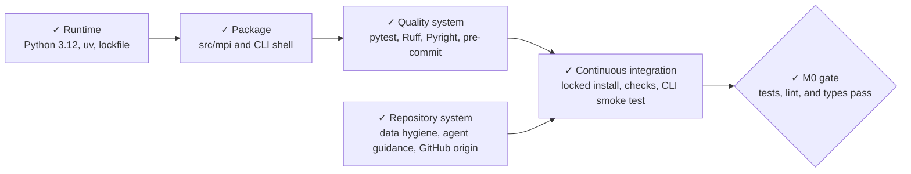

# M0 — Repository foundation

**Status:** `✓ Complete`

**Objective:** establish a reproducible Python project and automated engineering
quality gates without adding modeling.

## Completion evidence

- `uv.lock` resolves under Python 3.12.
- `uv run pytest` passes.
- `uv run ruff check .` passes.
- `uv run pyright` passes.
- GitHub Actions runs the locked installation, checks, and CLI smoke test.
- `main` is tracked on GitHub; repository visibility is a separate publication decision.

The [implementation roadmap](../implementation-roadmap.md) owns the current
cross-milestone status.
