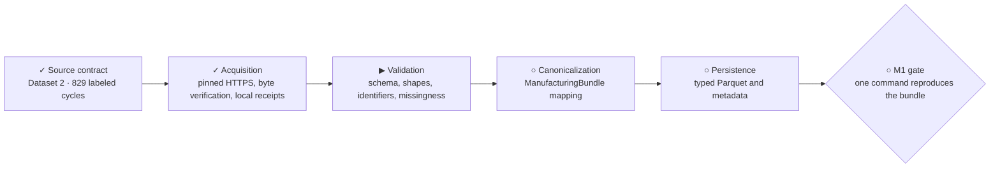

# M1 — Injection-molding source contract and ingestion

**Status:** `◐ In progress — source contract and acquisition complete`

**Objective:** verify the high-resolution injection-molding source, preserve its
provenance and semantics, and reproducibly transform it into the canonical
manufacturing bundle without adding modeling.



## Tracked outputs

- `docs/datasets/injection-molding-source-contract.md`
- `configs/datasets/injection_molding.yaml`
- an acquisition manifest under `data/manifests/`
- an injection-molding adapter under `src/mpi/datasets/`
- schema, join, and fixture-backed tests
- a reproducible CLI preparation command

## Acceptance gate

- the authoritative source, release identity, file roles, license, and hashes are recorded;
- automated acquisition and redistribution boundaries are explicit;
- raw inputs remain immutable and outside Git;
- cycle identifiers join process trajectories to quality targets without ambiguity;
- validated raw inputs map to the canonical bundle and typed Parquet outputs;
- one documented CLI command reproduces the prepared bundle from admitted raw inputs;
- tests, lint, formatting, and static type checks pass.

## Completed phase — Source-contract verification

**Execution state:** complete. Dataset 2's 829 labeled cycles are accepted with
limitations at source commit
`7bd35941d75c97a3f276439377dc430ab47402be`. This completes only the source-contract
subsystem, not M1. See the
[source contract](../datasets/injection-molding-source-contract.md) and
[source manifest](../../data/manifests/injection-molding-source.json).

### Outcome and scope

Establish whether the selected injection-molding files can support physical
quality prediction with defensible process-to-part identity and validation
boundaries. Give the acquisition and adapter implementation a reviewable contract
based on inspected source evidence.

The canonical specification's sections 10, 27–29, and 38 govern admission,
canonical mapping, provenance, and M1 acceptance. The accepted pivot is recorded
in [ADR-0001](../adr/0001-injection-molding-replaces-solidair.md).

Current implementation supplies configuration validation, identifier types, and
the CLI foundation. It has no dataset adapter or implemented ManufacturingBundle;
`injection_molding.yaml` remains disabled and pins the admitted source commit.

This phase covers source inspection, permitted local evidence acquisition,
reproducible structural checks, and an admission decision. Production download
commands, adapters, Parquet preparation, modeling, and M2's full statistical audit
remain outside this phase. Detail later subsystems after this evidence is available.

### Execution sequence

1. **Establish authority and terms before downloading data.** Start from the
   publisher repository and paper linked in canonical section 5. Verify their
   relationship, identify the publisher and applicable license text, and record
   retrieval dates and immutable source references. Establish whether automated
   retrieval, local use, raw redistribution, and publication of derived artifacts
   are permitted. A paper license alone does not establish coverage of data files.
   If coverage is unclear, record the exact gap and leave acquisition blocked.
2. **Freeze an inventory.** Enumerate the source's actual files and roles.
   Investigate the candidate archives `dataset1.zip`, `dataset2.zip`, and
   `dataset3.zip`.
   Pin a commit or immutable release, then record exact paths, download URLs,
   declared sizes where available, and inclusion/exclusion reasons. Distinguish
   source-declared metadata from locally measured values.
3. **Acquire inspection evidence under the verified terms.** Store selected raw
   bytes beneath ignored `data/raw/injection_molding/`, preserving source filenames
   and version identity. Record actual byte sizes, UTC acquisition timestamps,
   and locally computed SHA-256 hashes. Inventory archive members and inspect
   formats without executing source-supplied code or modifying original bytes.
   Reuse existing bytes only after checking identity and hashes; preserve a
   mismatch as a reported discrepancy rather than overwriting it silently.
4. **Establish schema and manufacturing meaning.** For each candidate input,
   record file/member roles, dimensions, column names and types, missing-value
   encodings, physical entity per row/sample, and source-supported units. Identify
   cycle keys, experiment boundaries, production-day fields, process variables,
   pressure/flow trajectories, weight and geometry measurements, interventions,
   and operating states. Verify the specification's trajectory length and sampling
   interval against the admitted files. Distinguish elapsed signal time, cycle
   order, and real production timestamps; do not infer dates from row order.
5. **Prove identity and suitability on the selected inputs.** Count null and
   duplicate keys, matched and unmatched process/quality records, and join
   cardinalities across all selected records. Determine whether keys require an
   experiment/file namespace, and whether multiple quality characteristics or
   repeated measurements explain multiplicity. Do not use positional joins
   without authoritative alignment evidence and checks that preserve it. Record
   target availability and measurement timing, potential leakage fields, repeated
   units, and available day/experiment/chronology boundaries. Establish whether
   those boundaries can support later leakage-aware validation without designing
   the final M3 split. Record quality limits only if supplied by an authoritative
   source; absent limits remain absent.
6. **Select and hand off.** Select the primary MVP input or justified combination
   based on process-to-quality linkage and validation suitability. Explain the
   exclusions. Map only supported fields to the conceptual bundle sections and
   identify unsupported sections explicitly. Save the evidence, admission outcome,
   limitations, and concrete next action in the artifacts below. Reconcile this
   milestone's source-contract status and roadmap if execution changes readiness.

### Deliverables and their owners

| Artifact | Required content |
| --- | --- |
| `docs/datasets/injection-molding-source-contract.md` | Authority and terms; pinned source; experiment/file roles; observed schema and units; identity and join rules; targets and availability; chronology and interventions; leakage risks; quality-limit availability; bundle mapping; all three admission gates; selection, limitations, and decision. |
| `data/manifests/injection-molding-source.json` | Dataset and source identity; retrieval references; license evidence; exact acquired paths, byte sizes, SHA-256 hashes, acquisition times, and admission membership. Distinguish inspected candidates from admitted files. |
| Reproducible inspection evidence linked from the source contract | Commands or a small inspection script with invocation and environment details; exact input identities; observed shapes and key/join counts; failures and their affected files. Keep raw extracts and generated data outside Git. |

The inspection manifest describes source evidence only. Processed hashes, adapter
version, and split definition from canonical section 29 are deferred to their
producing phases; do not invent values or imply that preparation has occurred.
The contract references the manifest for exact hashes instead of maintaining a
second independent hash inventory. Any inspection script is evidence tooling,
not the production adapter.

### Decision and failure behavior

Evaluate scientific, validation, and portfolio suitability separately, then record
one admission outcome:

- **Accept:** selected inputs meet all three gates with the required evidence.
- **Accept with limitations:** all three gates still pass, but documented limits
  constrain supported claims or available fields without changing accepted MVP
  requirements. State the consequences for downstream work.
- **Reject:** observed evidence shows the selected inputs cannot satisfy a
  required gate. Explain the failed requirement and affected downstream work.

Missing evidence is **unresolved**, not acceptance or proven rejection. Network
failure, unreadable archives, uncertain license coverage, ambiguous joins, or
unsupported chronology remain explicit blockers where they prevent a gate verdict.
Continue independent inspection where possible. Failure of one candidate need not
reject a separately proven input; record the excluded candidate and assess the
selected set as a whole. A limitation that would change accepted scope requires
that decision to be resolved before dependent ingestion proceeds.

### Completion evidence

- [x] Authority, exact source identity, license coverage, and publication boundaries
  have cited evidence; terms were checked before acquiring data.
- [x] Every selected raw file has a reproducible location, measured size and hash;
  local bytes agree with the manifest and remain outside the Git upload set.
- [x] The contract accounts for every dataset-admission field in canonical section
  10, distinguishing verified facts, unavailable fields, and unresolved evidence.
- [x] Full selected-input key and join counts establish process-to-quality linkage;
  unexplained duplicates or unmatched records cannot be concealed by a sample join
  or silent row dropping.
- [x] Scientific, validation, and portfolio gates have separate evidence-backed
  verdicts, and the selected input and overall decision follow from those verdicts.
- [x] A fresh implementer can recover the same inputs, rerun the inspection, and
  understand supported bundle mapping and limitations from the saved artifacts.
- [x] Repository checks pass for any tooling changes; documentation links and
  whitespace are checked, and the milestone records results and remaining gaps.

An accepted source contract permits planning the acquisition subsystem. A rejected
or unresolved source leaves dependent ingestion blocked. Neither outcome completes
M1's end-to-end preparation gate, and dataset configuration remains disabled until
the corresponding implementation can actually consume the admitted source.

### Source-contract completion evidence

- Source authority and CC BY 4.0 coverage were checked before acquiring bytes.
- The manifest pins all three inspected archives at commit
  `7bd35941d75c97a3f276439377dc430ab47402be` with measured byte sizes and SHA-256
  hashes; local bytes are under ignored `data/raw/injection_molding/`.
- `scripts/inspect_injection_molding_source.py` verified full schemas, nulls,
  trajectory grids, unique cycle keys, and joins. Dataset 2 has 829 unique labeled
  cycles, all matched to required pressure and flow, plus 92 explicitly excluded
  signal-only cycles.
- The source contract records separate scientific, validation, and portfolio passes,
  the observed 2,048-point slightly irregular grid, unresolved geometry storage
  units, experiment-versus-day boundary limits, and candidate exclusions.
- Repository checks and the inspection rerun passed on 2026-09-12; raw inputs remained
  outside the Git upload set.

## Completed phase — Reproducible acquisition

**Execution state:** complete. The accepted source contract was the prerequisite.
This phase delivers verified archive bytes and acquisition provenance, not
validated manufacturing records or a prepared dataset.

### Outcome and scope

A developer can acquire the admitted archive on a clean checkout, or reuse an
identical local archive without network access, through a documented MPI command.
The next validation subsystem receives an explicit archive identity and path;
it does not need to guess whether a download succeeded.

Acquire only the manifest's admitted `dataset2.zip`. Preserve the complete
archive, including its 92 signal-only cycles; selecting the 829 labeled cycles
belongs to validation/canonicalization. Do not download Dataset 1 or Dataset 3
as a production prerequisite. Their existing inspection evidence remains intact.

Excluded: archive extraction, HDF5 parsing, schema/join validation, bundle types,
Parquet output, modeling, source upgrades, generic downloader frameworks, and
automatic replacement of mismatched evidence. Dataset configuration remains
disabled for preparation; explicit acquisition is allowed independently of that
flag and must not advertise preparation readiness.

### Caller and handoff contract

Planned command, run from the repository root:

```powershell
uv run mpi data acquire injection_molding
```

Use the existing dataset configuration and checked-in source manifest as inputs.
Support `--raw-root <directory>` for an isolated destination (including tests and
the clean-acquisition check); default to `data/raw/injection_molding/`.
Within that root, use `scatimdata-<source_version>/dataset2.zip`, matching the
existing inspection layout. Resolve destinations beneath the selected root;
reject absolute/traversing manifest paths and unsafe link-based escapes.

Before network or output writes, validate the required manifest fields, exactly
one admitted Dataset 2 archive, positive expected size, SHA-256 syntax, and
agreement of dataset/repository/version with the configuration. The pinned HTTPS
download URL must agree with that source identity; never resolve a moving branch
or silently accept a different manifest/configuration pair.

On success, return a typed acquisition result to Python callers and report the
verified archive path, source version, size/hash, receipt path, and
`downloaded` or `reused` disposition through the CLI. Exit zero only when both
archive verification and receipt persistence succeed. The future validation
stage consumes this result, but must recheck raw identity at its own read boundary.
The result means **byte-verified**, not schema-validated or M1 complete.

### Identity, provenance, and transport decisions

- The existing `data/manifests/injection-molding-source.json` owns expected
  identities and historical inspection provenance. Acquisition reads it; it
  never updates expected hashes to match downloaded bytes or rewrites inspection
  timestamps. No second checked-in inventory is introduced.
- Write local acquisition receipts beneath the selected raw version directory,
  outside Git. Each successful invocation records dataset/candidate, source
  commit and URL, expected and observed size/hash, archive path, manifest-content
  hash, UTC verification time, disposition, and acquisition implementation/project
  version where available. Record a download timestamp only for a download made
  by that invocation; reuse must not invent the original download time. Preserve
  prior receipts and bind every receipt to its archive identity.
- Prefer direct streaming HTTPS from the manifest's immutable URL: only one
  admitted archive is needed, and this avoids requiring Git or fetching the
  excluded candidates. Existing evidence verifies Git transport, not this HTTP
  path; the implementation gate must demonstrate a real pinned HTTP retrieval.
  If that fails, report the transport gap rather than silently claiming success
  from the existing clone. A verified manual local copy remains a reuse path.
- Use existing runtime capabilities where sufficient; do not add HDF5/Pandas
  dependencies for byte acquisition. Do not import the inspection script into
  production code. Keep source-specific selection under `src/mpi/datasets/` and
  CLI dispatch in the existing CLI; factor only genuinely reusable byte checks.

### State and failure behavior

| Starting state or event | Required observable behavior |
| --- | --- |
| Final archive absent | Stream to a uniquely owned temporary file on the destination filesystem; check exact size and SHA-256 before publishing the final path. |
| Final archive present and matches | Hash the actual bytes, reuse without any network call, and create a reuse receipt; do not alter the archive. |
| Final archive present but differs | Fail nonzero with path and expected/observed identity; leave bytes untouched, do not download a replacement, and explain manual preservation/removal before retry. |
| HTTP error, timeout, truncated or oversized response, checksum mismatch | Fail nonzero; never publish unverified bytes as the final archive. Remove only temporary bytes owned by this invocation; retain diagnostic expected/observed identity. |
| Interruption or stale partial file | Partial bytes never count as an archive. Clean this invocation's partial file on handled cancellation; a later run ignores other orphaned partials rather than resuming or deleting them. |
| Another invocation targets the same destination | Serialize or fail clearly before conflicting publication. Never overwrite a final archive that appeared during acquisition; recheck it or report a conflict. Stale ownership must not be cleared automatically without proof. |
| Archive published but receipt write fails | Report nonzero and the verified archive's retained path. A rerun verifies and reuses it, then writes a receipt; do not redownload or invent a prior timestamp. |

Bound network reads with a finite timeout and an overall deadline; bound bytes
by the manifest size and reject excess data. No automatic retries are required
in this slice: rerunning the command is the explicit recovery mechanism. Do not
disable TLS verification or fall back to unpinned URLs. Publish receipts without
exposing a partial JSON file as a successful result. A blocking standard-library
HTTPS read is bounded by its finite transport timeout rather than asynchronously
cancelled mid-read; the overall deadline is rechecked after every read and before
publication, so late bytes or a late EOF cannot become a published archive.

### Implementation sequence

1. Define and test the admitted-source input validation and typed acquisition
   result against the current configuration/manifest. Keep inspection-only fields
   readable without falsely requiring deferred processed/split metadata.
2. Implement byte verification, safe destination ownership, bounded transport,
   publication, and receipt handling with injected transport for offline tests.
3. Connect the production function to the planned CLI. Exercise both downloaded
   and reused results through the real CLI-to-acquisition handoff.
4. Document acquisition and recovery in README and the source contract, preserving
   the separate three-candidate inspection instructions. Run clean live retrieval,
   then offline reuse, and record evidence here without committing raw bytes.
5. Reconcile the diagram/checklist and roadmap only after the acquisition gate
   passes. Detail raw validation next; do not implement it under this phase.

### Acceptance and evidence

- [x] A fresh destination acquires only the admitted archive via the real command;
  independently measured size and SHA-256 match the checked-in manifest.
- [x] A second invocation succeeds with networking unavailable, reports reuse,
  preserves archive bytes, and produces truthful provenance.
- [x] Offline synthetic tests cover manifest/config mismatch before effects,
  invalid paths, existing mismatches without overwrite or network access, HTTP
  failure, truncation/excess bytes, incorrect hash, interruption, destination
  conflicts, and receipt failure followed by recovery. Tests assert filesystem
  outcomes as well as exit/result status; no third-party data fixtures are added.
- [x] A success receipt parses and matches the actual produced archive and
  result. Failed or partial downloads cannot be consumed as a success result.
- [x] Existing three-archive inspection behavior remains usable; acquisition does
  not require excluded archives or claim the 829-cycle schema gate has passed.
- [x] Required repository checks pass: Ruff lint/format, Pyright, pytest, and CLI
  smoke/help. Verify raw archives, receipts, and temporary files stay outside the
  Git upload set; check documentation links and `git diff --check`.

Record the exact live command, source identity, verification results, reuse check,
and any remaining gap. Synthetic transport tests alone do not prove live retrieval;
an unavailable live endpoint leaves that gate unverified, not complete. This phase
does not require an ADR or change any accepted manufacturing semantics.

### Acquisition completion evidence

- `src/mpi/datasets/injection_molding.py` validates the checked-in configuration
  and manifest before effects, selects only the admitted Dataset 2 archive, streams
  the immutable HTTPS URL with finite bounds, and returns an `AcquisitionResult`
  after byte verification and atomic receipt persistence.
- On 2026-09-12, `uv run mpi data acquire injection_molding --raw-root
  .scratch/acquisition-live-final-20260912` started from a confirmed-absent destination
  and downloaded source commit `7bd35941d75c97a3f276439377dc430ab47402be`.
  Independent measurement found 8,708,313 bytes and SHA-256
  `69294087889a52791c296734051d6b21b30847c2859613e4178074182150c491`, exactly
  matching the source manifest.
- A second real CLI invocation with HTTP, HTTPS, and all-protocol proxies forced to
  an unavailable local endpoint reported `reused`, wrote a distinct receipt, and
  left archive size, SHA-256, and modification time unchanged. The reuse receipt
  contains no invented download timestamp.
- Synthetic tests cover input mismatch before effects, invalid manifest paths and
  URLs, resolved archive and receipt escapes, offline reuse, mismatched existing
  bytes, HTTP failure, truncation, excess bytes, checksum failure, late EOF after
  deadline, interruption cleanup, conflicting ownership, and real receipt-directory
  obstruction with offline recovery. The real CLI handoff is exercised for both
  dispositions, including nonzero retained-archive guidance and lock cleanup.
- Repository verification on 2026-09-12 passed Ruff lint and format, Pyright strict,
  28 pytest tests, CLI version/help smoke checks, inspection-tool tests, documentation
  link checks, and Git whitespace/raw-artifact hygiene. No raw archive, receipt, or
  temporary acquisition file is in the Git upload set.

**Next action:** detail and implement raw validation when authorized. It must recheck
the acquisition result's archive identity at its own read boundary. Canonicalization
and persistence remain deferred.

The [implementation roadmap](../implementation-roadmap.md) owns cross-milestone status.
