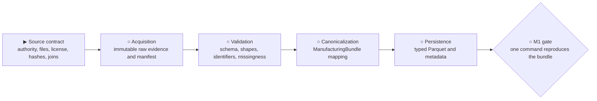

# M1 — Injection-molding source contract and ingestion

**Status:** `▶ Next — not started`

**Objective:** verify the high-resolution injection-molding source, preserve its
provenance and semantics, and reproducibly transform it into the canonical
manufacturing bundle without adding modeling.

## Tracked outputs

- `docs/datasets/injection-molding-source-contract.md`
- `configs/datasets/injection_molding.yaml`
- an acquisition manifest under `data/manifests/`
- an injection-molding adapter under `src/mpi/datasets/`
- schema, join, and fixture-backed tests
- a reproducible CLI preparation command

## Acceptance gate

- the authoritative source, release identity, file roles, license, and hashes are recorded;
- automated acquisition and redistribution boundaries are explicit;
- raw inputs remain immutable and outside Git;
- cycle identifiers join process trajectories to quality targets without ambiguity;
- validated raw inputs map to the canonical bundle and typed Parquet outputs;
- one documented CLI command reproduces the prepared bundle from admitted raw inputs;
- tests, lint, formatting, and static type checks pass.

Detailed subsystem planning begins only after the source contract is verified. The
[implementation roadmap](../implementation-roadmap.md) owns cross-milestone status.
