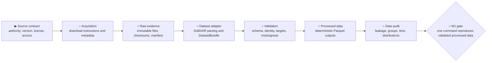

# M1 — SoliDAIR ingestion

**Status:** `▶ Next`

**Objective:** reproducibly acquire, validate, transform, and audit the authoritative
SoliDAIR distribution without committing third-party data.

## Tracked outputs

- source and download documentation;
- raw-data provenance manifest and checksums;
- SoliDAIR dataset adapter;
- validation rules and contract tests;
- deterministic processed Parquet layout;
- reproducible data-audit artifact.

## Gate

From an empty local data directory, the documented acquisition and preparation
commands produce validated processed data and a provenance manifest. A repeat run
with identical source inputs produces identical processed hashes.

Source identity, licensing, unit and target meaning, production versus simulation
status, and available grouping or time fields must be established from evidence.
Do not invent missing semantics or specification limits.

The [implementation roadmap](../implementation-roadmap.md) owns the current
cross-milestone status.
