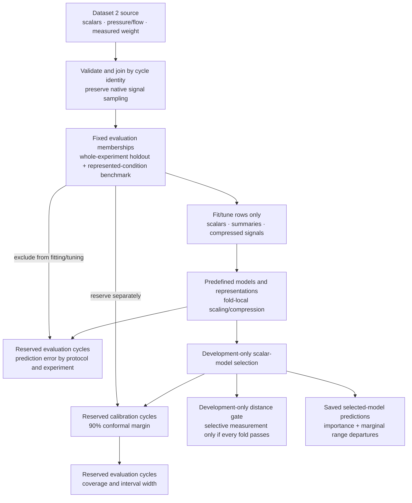

# M10 — Offline portfolio dashboard

**Status:** complete.

## Purpose and accepted scope

Give a portfolio reviewer a clear, runnable account of Dataset 2: strong prediction
within represented regimes did not translate into reliable unseen-regime results.
Present existing evidence, not another modeling experiment. The
[specification](../spec.md#explanation-dashboard-and-release) owns release scope;
[M7](m07-uncertainty-and-shift.md) and [M9](m09-predictive-explanation.md) own
uncertainty and explanation interpretation.

One local Streamlit application with Plotly figures, reading the prepared bundle
and saved M4–M7/M9 artifacts. No training, downloads, artifact writes or remote
services during dashboard use. Missing inputs show actionable reproduction commands,
not a fabricated demo or automatic pipeline run. Existing README commands remain
the reproduction workflow. No authentication, database, configurable dashboard
framework, new analytics, deployment, model persistence or compatibility layer.

## Three tabs

1. **Data & process:** explain machine telemetry → part weight; show experiment
   counts and weight distributions, plus selectable pressure/flow cycle examples
   against their native elapsed-time grid. Identify weight in grams and unknown
   signal amplitudes as native units. Experiments are not calendar days.
2. **Prediction & generalization:** compare pooled held-out and pooled ID MAE with
   identical cycle weighting; retain primary equal-fold MAE separately. Show scalar baselines and matched Ridge/
   LightGBM representation comparisons without selecting a universal winner.
   Allow per-experiment metrics and actual-versus-predicted inspection. Keep ID
   per-experiment results available, not just its pooled R². Include a small
   selectable M9 population-specific importance view, retaining negative values
   and warning that correlated inputs and poor transfer complicate interpretation.
3. **Reliability under shift:** show 90% nominal and empirical coverage by
   population, widths and illustrative saved intervals. Put M9 outside-training-
   range fractions in a feature-by-experiment heatmap nearby, with ID subsets
   available for contrast. Explain the failed development distance gate and M8
   skip; do not invent selective-measurement curves or a support-based policy.

## Scientific presentation

- Derive displayed values from saved data, including any presentation-only grouping;
  do not maintain a second hand-entered results table. Preserve unit joins and
  distinguish model/representation/protocol/population selectors.
- The predefined primary scientific metric remains equal-fold MAE. The reviewer
  comparison uses pooled-to-pooled MAE, explicitly labeled with cycle weighting.
  ID-versus-primary compares different fitted pipelines,
  not a paired estimate of the effect of shift. M2 inspected all experiments.
- Show small nonzero coverage accurately (experiment 23 is approximately 0.3%,
  not 0%). Distinguish pooled ID coverage from per-experiment coverage.
- Observed marginal range departures are neither full distributional support nor
  causal explanations or product limits. If a maximum range fraction is summarized,
  name the features/populations over which that maximum was taken.
- Feature shift co-occurs with errors; it has not been established as their dominant
  cause. No physical RCA, PASS/FAIL, manufacturing specification or deployment claim.
- Negative results are legitimate findings. No new features, scores or model search.

## Delivery approach

Build the smallest application and a few direct presentation helpers where they
make data selection/aggregation independently testable. Add Streamlit/Plotly to
the locked environment; keep raw data and generated artifacts ignored. Reuse
existing metric functions where practical, without changing the modeling code.
Update README launch/prerequisite instructions and the roadmap. Keep package
versions and Git tags unchanged; release publication is a separate user action.

One final integrated review covers the runnable dashboard and documented workflow;
there is no costly intermediate interface requiring a separate checkpoint.

## Acceptance and evidence

- Local launch renders all three tabs from existing real artifacts without model
  fitting or source mutation. Exercise selectors and inspect representative charts
  at desktop size for readable labels, legends and units.
- Focused synthetic tests distinguish equal-fold from pooled aggregation, preserve
  protocol/experiment identity and small nonzero coverage, and cover the ordinary
  app path plus useful missing-input guidance. Prefer Streamlit's app testing to
  a separate browser automation dependency. No full training in CI.
- Independently reconcile representative displayed metrics with saved predictions
  or artifact rows, including per-experiment ID results and the support heatmap.
- Run existing CI checks and a real-data application smoke test. Record any actual
  visual-verification gap rather than treating a server-health response as proof
  that the dashboard renders correctly.
- Finish this record with implementation, verification, limitations and next step.

## Implementation

### Reviewer-surface delivery — 2026-09-19

Purpose: make the completed study understandable in a short first read, with dashboard
claims that remain consistent with the evidence actually loaded. This is presentation
and artifact consistency work; existing experiments, artifacts and scientific protocols
remain unchanged.

Accepted outcome:

- README leads with problem, comparable pooled PLS errors (0.114 vs 0.523 g), interval
  coverage and practical implication, then one preview. Preserve the predefined
  0.503 g equal-experiment metric in technical detail. These compare separately fitted
  protocols, not a causal estimate. State missing authoritative weight tolerances and
  the limited evidence of three specific transfer scenarios near the results.
- Dashboard counts, means, variance fraction, errors, coverage/widths, selected models,
  feature-importance counts and gate values/status derive from loaded tables/run records.
  Static dataset context and prescribed method constants may stay static, clearly
  distinguished from computed evidence. Conditional conclusions must not contradict
  synthetic or regenerated results; absent groups must not produce invented observations.
- Use descriptive model, representation and evaluation labels throughout visible charts,
  selectors and tables. Keep internal identifiers unchanged in saved artifacts. Explain
  virtual measurement as software estimating a physical measurement; no global production
  model was selected. Present completed findings rather than future analysis questions.
- Lead the dashboard with a small evidence summary. Keep essential context and charts
  visible; put longer methodology behind expanders. Preserve a brief data-to-results
  flowchart in both surfaces and retain its full technical detail here. Consolidate README
  reproduction into one complete sequence, retaining useful commands and methodology links.
- Verify M9's existing hashes of M7 run.json and evaluation predictions against the loaded
  files, in addition to existing source/membership checks. A mismatch has actionable
  regeneration guidance; no new registry or artifact format is required.

Delivery approach: revise presentation derivations and consistency checks, simplify the
reader journey and reconcile this record, then verify the integrated result. One final
checkpoint covers the whole change because there is no external interface migration.
Keep the single dashboard module and existing dependencies. No training, tuning, new
analysis methods, deployment, release tag, version bump, commit or push is included.

#### Technical study flow

Source manifests own source identity; fixed memberships own train/calibration/evaluation
roles. Scaling, compression, tuning and model selection stay inside the permitted training
or development rows. Prediction intervals use separately reserved calibration rows.
Explanation reloads the selected settings and verifies its source M7 run and prediction
hashes. Outer results describe performance; they do not select a universal model.

Acceptance: focused synthetic tests must prove that displayed quantities follow fixture
values and group membership, and reject either M7 hash mismatch. Independently compare
the real headline and gate summaries with existing prediction/run records. Run CI checks,
real-artifact app smoke, and visually inspect all three tabs and updated screenshots.
README content/links and the brief/full diagrams must tell the same scientific story.

Progress: complete. Final review verified the loaded-result comparisons, conditional
interpretation, hash checks and reader flow. All three tabs were visually inspected and
the tracked overview, prediction and reliability screenshots refreshed from the final
dashboard. No scientific artifacts, models or release versions changed.

`src/mpi/dashboard.py` provides the single offline Streamlit entry point. It loads
the prepared Dataset 2 bundle and saved M4-M7/M9 Parquet/JSON outputs directly,
then renders the three accepted tabs with Plotly. Small presentation helpers own
the independently tested equal-fold versus pooled MAE, per-experiment metrics,
coverage labels, weight/context join, experiment/variance summaries, uncertainty and
distance-gate headlines, and feature-support heatmap shaping. Visible result claims now
follow those loaded summaries rather than a second prose results table.

The data tab shows the 303/223/303 experiment counts, weight distributions in
grams, and selectable pressure/flow cycles on the native elapsed-time grid. The
prediction tab separates primary equal-fold, primary pooled sample-weighted and
separately fitted pooled ID MAE; compares the same A/B/C representations for Ridge
and LightGBM; exposes primary and ID per-experiment predictions; and retains signed
population-specific permutation importance. The reliability tab keeps nominal,
primary and pooled/per-experiment ID coverage distinct, shows saved intervals and
the feature-by-experiment marginal range-departure heatmap, and records the failed
distance gate and M8 skip without proposing a policy.

The locked runtime now includes Streamlit and Plotly. The README owns the launch
command, prerequisites and launch-time disabling of Streamlit usage telemetry.
Missing inputs name every absent path and show the existing bounded reproduction
commands; the dashboard does not run them or write artifacts.

Release polish gives the app an injection-molding title and Dataset 2 subtitle.
Streamlit caches loaded evidence between widget interactions; an explicit reload
button refreshes it after local artifact regeneration. On load, existing milestone
run records must agree on source/version and membership identity, with the source
also matched to prepared metadata. This is a consistency check of recorded lineage,
not a Parquet-integrity registry or automatic stale-file detector.

## Verification

### Reviewer-surface verification — 2026-09-19

- Focused dashboard tests passed: 12 cases cover loaded-derived experiment, prediction,
  coverage and gate summaries; changed synthetic metrics and membership; both M7 hash
  mismatches; missing-input guidance; cache/reload behavior; and all three tabs plus
  selector reruns through Streamlit's application test harness. The changed-outcome case
  reverses the real study's error and coverage relationship, makes an augmented
  representation outperform, and passes every gate fold; the rendered narrative follows
  those loaded outcomes without retaining failure claims.
- The real-artifact application rendered all three tabs, reran the represented-condition
  support selector and explicit reload without exceptions. Independent calculations from
  saved predictions recovered pooled PLS MAE of 0.113668893 g for represented conditions
  and 0.523299419 g for unseen-experiment evaluation; interval coverage of 0.862275449 and
  0.051869723; and development reductions of 0.196563815, 0.043129992 and 0.163110092.
  Direct hashing confirmed that M9's recorded M7 run and prediction hashes match the
  currently configured M7 files.
- Browser inspection at 1280 × 720 confirmed that the overview KPI strip, tolerance caveat,
  brief flow, descriptive chart labels, prediction comparison and reliability result are
  readable. The tracked PNG files have not yet been refreshed from this final surface.
- CI-equivalent checks passed: Ruff lint and format, Pyright, all 90 tests and the CLI
  version smoke (`0.0.1`). README/M10 local links also resolved. Pytest emitted one
  environment-only warning because its ignored cache directory was not writable.

- `uv sync --locked --group dev` completed against the 122-package lock.
- CI-equivalent checks passed: `ruff check .`, `ruff format --check .`, `pyright`,
  all 86 tests, and `mpi --version` (`0.0.1`).
- Eight focused dashboard cases cover synthetic equal-fold versus pooled aggregation,
  protocol/experiment preservation, experiment 23-style small nonzero coverage,
  analytic MAE/RMSE/R² including null R² for a constant target, support populations,
  actionable missing-input guidance, all three tabs and a selector rerun through
  Streamlit's application test harness. The release-polish cases also verify cache
  reuse/explicit reload and rejection of mixed source or membership records. The
  real-data app passed a selector rerun and explicit reload with all three tabs.
- The real-data application test rendered all three tabs from the existing prepared
  bundle and M4-M7/M9 artifacts, then reran secondary-ID prediction and support
  selectors without exceptions. Direct reconciliation recovered PLS MAE of
  0.502667583 g (primary equal-fold), 0.523299419 g (primary pooled) and
  0.113668893 g (separately fitted pooled ID), three per-experiment ID Ridge rows,
  including experiment 23's 0.087060831 g MAE, 0.106434371 g RMSE and 0.539380043
  R², and all 48 primary feature-support cells with a maximum fraction of 1.0.
- Desktop browser inspection at 1280 × 720 confirmed readable tabs, headings,
  legends, axes and units for representative data, prediction, coverage, interval
  and support views. Changing support from primary to secondary ID visibly updated
  the heatmap. The temporary browser tab and local Streamlit server were closed.

## Limitations and next step

The dashboard is a local view of the current artifact schema, not a compatibility
reader or deployed service. It presents observed associations and marginal range
departures; neither establishes causal process drivers, complete distributional
support, product limits or conformance. Primary and ID values come from different
fitted pipelines. Coverage under shift remains poor, the development distance gate
failed, and M8 remains skipped. There is no selective-measurement curve or policy.

The bounded Dataset 2 MVP is ready for the separate release decision. No Git tag or
publication is part of this milestone; the roadmap's next decision is the post-MVP
source audit gate.

## Consolidated interpretation

The published work and this portfolio answer related but different questions. The
paper used repeated nested random cross-validation to test the incremental predictive
value of high-resolution pressure and flow signals when observations from the available
conditions can occur across folds. This project withholds a complete experiment group,
including its multiple intervention settings. Features and models also differ, so this
is an extension rather than an exact replication. Its transfer result does not contradict the published result; it
demonstrates that random-cycle accuracy is not evidence of new-condition transfer.

This experiment supports a bounded conclusion: part weight is predicted well when
the evaluated operating regimes are represented during fitting, but point accuracy
and interval reliability do not transfer reliably when a complete controlled
experiment is withheld. M9 shows that held-out regimes frequently extend beyond
observed marginal fitting ranges, which is direct evidence of extrapolation pressure,
not proof that support departure caused every error or that all future process
changes must fail.

Four secondary findings sharpen that conclusion. About 70.45% of observed weight
variation lies between the three controlled experiments, so pooled metrics partly
reward regime separation and can hide weaker within-experiment explanation. Scalar
PLS produced the lowest grouped aggregate error among the predefined scalar,
LightGBM and trajectory comparisons; added model or representation complexity did
not replace process-condition coverage. Its experiment-23 failure was directional:
every prediction was low, with -0.798 g mean signed error. The corresponding M7
interval averaged 0.550 g wide but covered only about 0.3%; this calibration-derived
margin was insufficient for the systematic underprediction. No separate widening study
was run. M7 selected PLS for this fold and LightGBM for the other primary folds and ID,
using development data. Its intervals have constant width per fitted model. Finally,
M9 importance changed across populations; correlated inputs and 40/96 negative mean
importances preclude a stable or causal sensor hierarchy.

Improving transfer requires labeled coverage across the conditions expected in use.
The intended operating envelope should be defined and sampled near its boundaries
and throughout its interior, including relevant combinations of material lots,
recipes, machines, temperatures, pressures and other physically meaningful context.
Boundary observations help establish the supported envelope; interior observations
teach interpolation within it. Additional context may be evaluated as a predictor
when its physical meaning and prediction-time availability are established.

A future adaptive workflow should be evaluated as a new experiment: detect conditions
outside the well-covered envelope, route those parts to physical measurement, add their labeled
outcomes to the training set, retrain/recalibrate, and continue validating on whole
unseen conditions, lots or machines. This is a recommended data-collection and
validation strategy, not a capability established by v0.1. The current distance
screen failed its gate, so no support-based rejection policy is claimed.
Interpolation inside a well-covered envelope may be reliable after validation;
extrapolation beyond it remains a separate, less reliable problem.

Trajectory information is useful without being automatically transferable. The
engineered and compressed representations tested here produced inconsistent improvements
across held-out conditions. A future study may compare direct raw-trajectory models or
representations designed for stability across conditions, but it must keep whole-condition
evaluation. Otherwise additional signal detail can improve interpolation while hiding the
same transfer failure.

Repeated collection across time with measured outcomes would also test the random-cycle
benchmark's potential optimism from neighboring-cycle dependence. Depending on those
data, the appropriate solution may be
separate process-family models, a shared model with qualified recalibration, or a
hierarchical/transfer-learning design rather than one universal model.

The current model is a completed-cycle virtual measurement of part weight. It is not an
early-cycle controller, physical root-cause model, product-conformance decision, setting
recommender or validated replacement for physical measurement.

## Future drift and intended-use controls

Input drift should be interpreted as evidence that the model may be outside its validated
use, not evidence that the part is defective. A future system should distinguish:

| Drift evidence | Candidate checks | Labels required? |
| --- | --- | --- |
| Data quality | Missing channels, changed units/sampling, malformed cycles | No |
| Operating context | Machine, mold, material lot or recipe changes | No |
| Covariate/trajectory shift | Ranges, robust scores, multivariate distance, PCA T²/SPE, trajectory shape | No |
| Temporal process drift | EWMA/CUSUM and gradual signal movement | No, but this dataset lacks authoritative wall-clock chronology for validation |
| Performance/concept drift | Residual error and changes in the process-to-weight relationship | Yes |
| Calibration drift | Prediction-interval coverage by condition | Yes |

Prospective evaluation should report detection rate, false-warning rate, detection delay,
the relationship between warnings and later error, recalibration coverage, and results by
the physical conditions relevant to use. A three-state interface could distinguish
**represented**, **boundary/drift warning**, and **unsupported** cycles. Its thresholds must
be selected on development data and validated before use. The M8 distance ranking failed,
so the current project has no qualified selective-measurement gate or automated policy.

The M8 stop is itself a reviewer-facing result. The tested score was mean standardized
five-neighbor distance across the 16 scalar process measurements. Its pre-specified gate
retained the lowest-distance 75% of development predictions and required at least 10% MAE
reduction in every primary fold. Reductions were 19.66%, 4.31% and 16.31% for future
holdouts 15, 20 and 23 respectively; the represented-regime diagnostic reached only
5.68%. Because one primary fold failed, no risk-coverage curve or automatic measurement
rule was produced. Input novelty may support a warning without reliably ranking prediction
error, and trying additional scores after observing this result would weaken the evidence.

A future intended-use contract must be enforced at inference time and should define the
supported machine/mold/material/target, required inputs and units, sampling grid and
prediction cutoff, operating envelope, validated performance by condition, unsupported
conditions, model/data identity, calibration date, measurement policy, and warning/refusal
rules. The intended lifecycle is: build the envelope, predict within it, detect approach to
or departure from it, physically measure unsupported cases, and expand/recalibrate using
their labeled outcomes.
