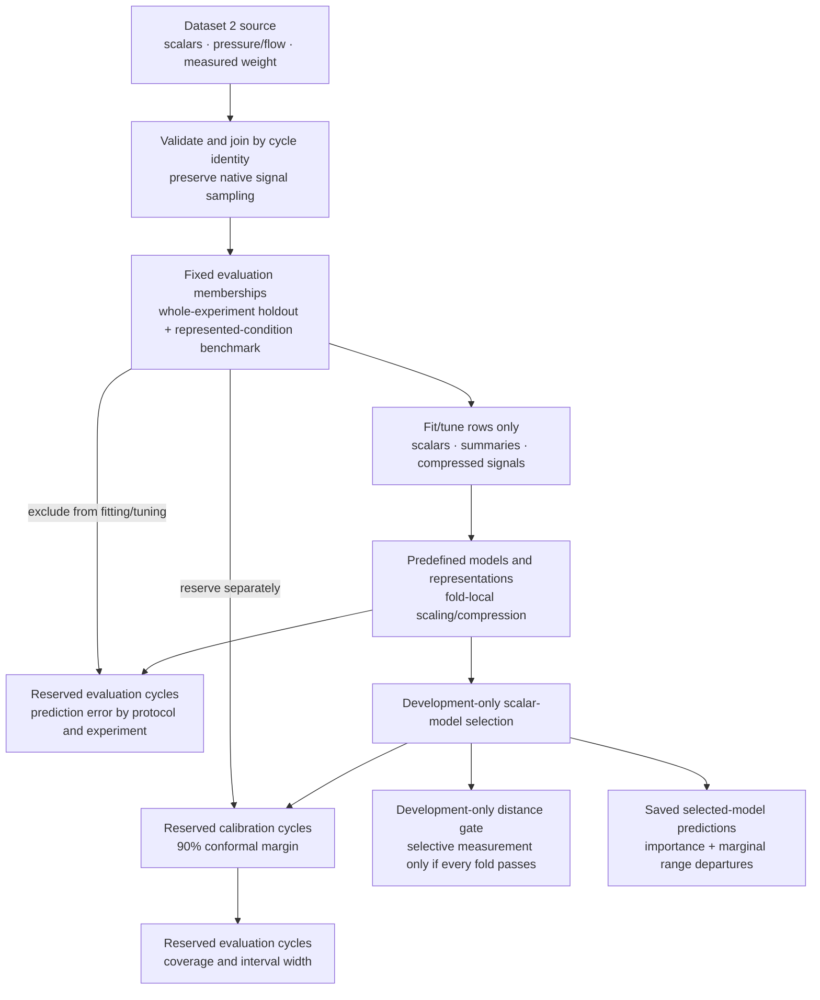

# M10 — Offline portfolio dashboard

**Status:** complete.

## Purpose

Give a new reader a runnable account of the Dataset 2 study: what was measured,
how prediction was evaluated, what transferred and what did not. The dashboard
presents saved evidence rather than running another modeling experiment.
The [specification](../spec.md#explanation-dashboard-and-release) owns scientific
scope; [M7](m07-uncertainty-and-shift.md) and
[M9](m09-predictive-explanation.md) own uncertainty and explanation methods.

## Implementation

One local Streamlit application with Plotly figures reads the prepared bundle and
saved M4–M7/M9 artifacts. It does not train models, download data or write artifacts.
Missing-input guidance lists acquisition, preparation and analysis commands in order,
to run from the repository root. README owns setup and reproduction instructions.

- **Data & process:** cycle/part linkage, experiment differences, weight distributions,
  and median pressure/flow profiles with the middle 80% and optional full observed
  range. Native timestamps are preserved; unconfirmed signal units remain explicit.
- **Prediction & generalization:** the default comparison uses two evaluation settings
  with the same cycle weighting, followed by trajectory benefits and per-experiment
  predictions. Equal-experiment metrics and aggregate representation comparisons remain
  in detail. Independently selected uncertainty-model importance has its own expander.
- **Reliability under shift:** measured interval coverage, calibration populations,
  interval examples, development screening and marginal training-range departures.
  The screening table names both the excluded experiment and the development
  experiments actually screened. Failed screening does not produce a measurement policy.

Displayed quantities and conditional conclusions follow loaded evidence. The loader
checks common source/membership identity and the exact M7 files referenced by M9.
It caches evidence with an explicit reload control; it is not an artifact registry.
Observed/predicted plots use a common padded axis range and equal physical scale.

### Technical study flow

Fitting, scaling, compression and tuning stay within permitted development rows.
Separate calibration rows come from represented experiments, not the omitted one.
Primary and represented-condition comparisons use separately fitted pipelines.
Equal-experiment MAE remains the predefined scientific summary; pooled MAE gives
each evaluated cycle equal weight. Initial exploration inspected all experiments,
so the study is retrospective, not prospective confirmation.

## Verification

The dashboard suite covers aggregation, cycle identity, small nonzero coverage,
source/membership consistency, M7 references, recovery ordering, screening populations,
equal plot geometry and conclusions that change with synthetic results. Full training
is excluded from CI. Real saved-data smoke tests and browser inspection exercise the
ordinary reader workflow; tracked previews show representative views.

The integrated checks passed 92 tests, Ruff lint/format, Pyright and CLI smoke.
Real-artifact app rendering verified the two-series pooled comparison; browser
inspection confirmed the simplified reading path and plain-language calibration
explanation. Prediction and reliability previews were refreshed. The existing
ignored pytest-cache permission warning does not affect test results.

## Consolidated interpretation

The dashboard makes the central study conclusion visible: strong accuracy with
represented conditions did not establish reliable transfer to an omitted experiment.
Trajectory additions were inconsistent; calibration from familiar conditions did not
provide reliable coverage under shift. The development distance screen failed its
predefined criterion, so M8 was skipped and no selective-measurement policy is claimed.

These are three controlled transfer scenarios, not a universal manufacturing result.
Input-range departures are not causal explanations or full multivariate support.
Permutation importance is population-specific and complicated by correlated inputs.
There are no authoritative product tolerances or verified production chronology.
The app is a local reader of current artifacts, not a deployed service or compatibility
layer. Models, saved results and versions are unchanged by presentation work.

## Next step

The completed MVP supports portfolio presentation. Future work should test broader
labeled operating conditions, whole-condition validation and recalibration before
considering measurement assistance. Detailed future monitoring proposals remain in
the README and scientific specification; the roadmap owns subsequent scope.
